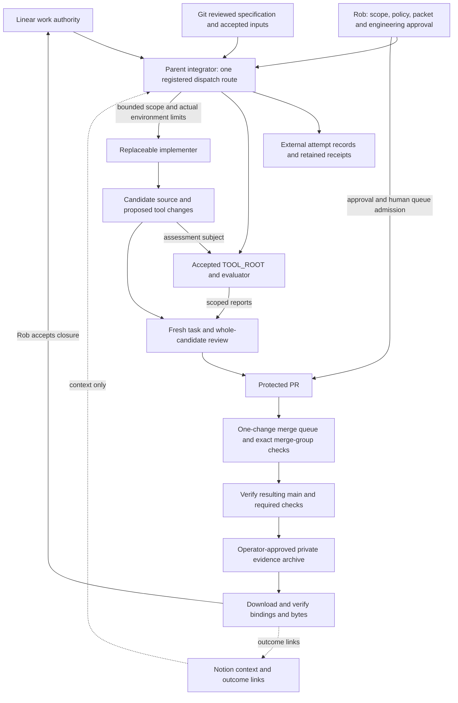

This page documents the proposed supervised engineering system that aims to create a repeatable, supervised path from a Linear engineering task to reviewed source, protected integration, and retrievable evidence. It elaborates the [approved engineering plan](https://github.com/Mindclade-org/mindclade-internal-monorepo/blob/main/docs/superpowers/plans/2026-09-23-engineering-governance.md) and [ADR-014](/architecture/adr/adr-014-engineering-factory-and-governed-evolution). Connected supervised engineering readiness is **BLOCKED**.

<Warning>
  This introduces no executable schema, permission grant, or vendor adoption. [Requirements traceability](/architecture/engineering/requirements-traceability) records ownership, required evidence, and remaining decisions. The [governance status](/architecture/engineering/governance-status) owns the dated operational baseline.
</Warning>

## Purpose and limits

The objective is a repeatable, supervised path from a Linear engineering task to reviewed source, protected integration, and retrievable evidence. A person must be able to establish what was authorized, which attempt produced a change, what exact candidate was evaluated, who accepted it, and what remains unproven. Recovery must preserve those distinctions when execution, review, or reporting fails. Replaceable workers may implement bounded changes; they cannot redesign the architecture or change the rules that qualify their own work.

This system does not redesign the scientific platform, replace Codegen, implement the planned execution kernel, create another backlog, install vendors, or grant unattended production authority. Source completion does not qualify scientific claims, release publishing, deployment, or a general autonomous factory.

The [master blueprint](/architecture/master-blueprint) supplies the platform context.

| Platform section | Engineering-system relationship |
| --- | --- |
| I: authority and scope | Reviewed Git specifications remain subordinate to the constitution, accepted ADRs, and architecture metadata. External context cannot become another master specification. |
| IV: ownership and dependencies | Governance tools inspect non-semantic records and evidence. They cannot reinterpret contracts, duplicate B4, or activate scaffolded modules. Codegen owns generated meaning and projections. |
| V: durable execution | Distinct identities, recorded effects, bounded retries, and confirmed cancellation apply to engineering operations. The current integrator maintains operator records; this does not implement PostgreSQL/outbox, runtime fencing, or a dispatch service. |
| VIII: delivery and change control | Locked tools, revision-bound verification and separately reviewed integration precede acceptance. A change to architecture law requires ADR review. |

The future shared-kernel work packet described in [execution reliability](https://github.com/Mindclade-org/mindclade-internal-monorepo/blob/main/docs/architecture/execution-reliability.md) is a planned platform contract. WorkPacket@v1 and GovernanceReport@v1 here are non-semantic engineering records. Do not merge those schemas or import proposed runtime fields into the frozen engineering interface. Runtime and scientific qualification retain their own gates in the [roadmap](/architecture/implementation-roadmap).

## Present source and intended operation

The table preserves the pre-integration source checkpoint of this design. Use the [current task register](/developer/agent-handoff#current-task-register) and revision-bound receipts for subsequent source milestones. Operator adoption and connected acceptance remain separate gates.

| Area | Source position at this documentation handoff | Required operating state |
| --- | --- | --- |
| Procedures | Roles, workflow, policy and developer/operator guides are candidate source. | Named owners follow accepted procedures for each admitted change. |
| Local governance | Admission, read-only GitHub audit, local evidence tools and their interfaces exist as candidate source; independent review and the full pinned aggregate remain pending. | A separately accepted evaluator assesses exact inputs from a trusted tool location. Candidate self-reports cannot establish trust. |
| CI | Candidate workflow includes `merge_group` and preserves main/queue evidence. | Required checks actually run at PR, synthetic merge-group, and resulting main revisions. |
| CI runner and R2 evidence substrate | A protected aggregate may consume a separate capability-specific prerequisite; exact-candidate diagnostics remain separate evidence lanes. | Required context stays fail-closed, each revision receives its own evidence, and deprecated compatibility runners migrate to a qualified ephemeral managed runner without weakening protection. |
| Connected GitHub | The dated baseline reports unprotected source main and SAML-blocked destination preflight. | Authorized private transfer, verified effective protection, dedicated App, protected probe, and human-admitted queue. |
| Evidence | Local bundle integrity tooling is candidate source. | Approved evidence is archived privately after main verification, downloaded and verified before closure. |
| Automation | Operator records and a single dispatch procedure are specified. | Each later automation proves duplicate handling, containment, and recovery before activation. |

### CI runner and R2 evidence blueprint

The protected `linux-foundation` context is the admission-facing aggregate. It may depend on a separately executed Linux capability prerequisite when the aggregate runner cannot honestly exercise that capability. The prerequisite is part of the required context's fail-closed semantics: a missing, BLOCKED, failed, or skipped prerequisite cannot be converted into a passing aggregate.

R2 uses two complementary evidence shapes:

1. **PR-bound prerequisite lane.** Runs the frozen R2 collector for the candidate exercised by the pull-request workflow, while the protected aggregate remains on its maintained Ubuntu baseline.
2. **Exact-candidate/resulting-main diagnostic lane.** A manual, read-only workflow accepts one exact candidate SHA, verifies checkout binding, runs the same collector and retains the semantic receipt. This lane supplements queue/main evidence; it does not replace protected required checks, CODEOWNER review, or merge-group execution.

Hosted Ubuntu 22.04 is permitted only as a bounded compatibility bridge while it continues to satisfy the frozen R2 semantics. The durable target is the reviewed ephemeral Azure/JIT substrate in the [implementation plan](https://github.com/Mindclade-org/mindclade-internal-monorepo/blob/main/docs/superpowers/plans/2026-09-28-ephemeral-linux-runner.md): immutable image, restricted runner group/repository, short-lived JIT registration, non-root execution, explicit namespace/AppArmor posture, TTL/orphan cleanup and retained lifecycle evidence. Cutover requires managed-runner qualification and fresh protected workflow review; `linux-foundation` remains the required context.

Every source-head, base, merge-group, and resulting-main identity owns distinct evidence. A stale CODEOWNER review or historical green run is never copied forward after a candidate changes. The bounded current reconciliation sequence is recorded in the [PR #54 plan](https://github.com/Mindclade-org/mindclade-internal-monorepo/blob/main/docs/superpowers/plans/2026-09-28-pr54-main-reconciliation.md).

This is the 2026-09-23 source checkpoint, not a fresh remote audit or a claim of accepted tooling. The [handoff verification record](/developer/agent-handoff#source-and-evidence-checkpoints) owns subsequent results. Historical foundation CI receipts in the [status record](/architecture/engineering/governance-status) qualify only their named source revisions. The [audit interface](/developer/governance-tools#github-audit) includes source support for complete paginated review-thread observations. Source support is not proof that those observations were obtained for a current candidate; separate exact merge-group evidence and live connected acceptance remain required. Successful local fixtures or PR/main observations cannot close those gaps; the complete protected loop still requires operator evidence.

## Authority and document map

Apply [AGENTS.md](https://github.com/Mindclade-org/mindclade-internal-monorepo/blob/main/AGENTS.md) precedence: user request and reviewed task contract; AGENTS; ADR-000; other ADRs; architecture YAML and maturity; master blueprint, repository layout, and delivery plans; source and tests. Resolve conflicts at the owning authority before dependent work continues. This blueprint connects those documents and cannot override them.

| Concern | Owning document or source |
| --- | --- |
| Resume an interrupted or transferred task | [Agent handoff](/developer/agent-handoff): exact branch/base and repository topology, candidate contents, current checks, external blockers, and resume order |
| Architecture constitution and engineering evolution | [ADR-000](/architecture/adr/adr-000-mindclade-vnext-architecture-constitution), [ADR-014](/architecture/adr/adr-014-engineering-factory-and-governed-evolution), [master blueprint](/architecture/master-blueprint) |
| Architecture identity, path ownership and implementation maturity | [Architecture YAML](https://github.com/Mindclade-org/mindclade-internal-monorepo/blob/main/docs/architecture/model/architecture.yaml), [repository layout](https://github.com/Mindclade-org/mindclade-internal-monorepo/blob/main/docs/architecture/model/repository-layout.json), [maturity](https://github.com/Mindclade-org/mindclade-internal-monorepo/blob/main/docs/architecture/maturity.yaml), [mechanical tree](https://github.com/Mindclade-org/mindclade-internal-monorepo/blob/main/docs/REPOSITORY_TREE.md) |
| Assignment, single dispatch route and separation | [Roles](https://github.com/Mindclade-org/mindclade-internal-monorepo/blob/main/.agents/roles/supervised.md) |
| Attempt lifecycle, invalidation, cancellation and recovery | [Workflow](https://github.com/Mindclade-org/mindclade-internal-monorepo/blob/main/.agents/workflows/supervised.md) |
| Admission, credentials, privacy and stop conditions | [Policy](https://github.com/Mindclade-org/mindclade-internal-monorepo/blob/main/.agents/policies/supervised.md); [policy source](https://github.com/Mindclade-org/mindclade-internal-monorepo/blob/main/.agents/policies/supervised.v1.json) is not its own approval |
| Daily handoff and task preparation | [Developer guide](/developer/supervised-development), [Linear template](/developer/linear-task-template), [PR template](https://github.com/Mindclade-org/mindclade-internal-monorepo/blob/main/.github/PULL_REQUEST_TEMPLATE.md) |
| Frozen record fields and admission interface | [Work-packet interface](/developer/work-packet-v1), owned by the admission component |
| Audit, local evidence and tool trust interfaces | [Governance tools](/developer/governance-tools), owned by the audit and evidence components |
| Transfer, App, protection, queue and archival procedures | [GitHub runbook](/operations/github-governance) |
| Evidence scope and future qualification | [Provenance](/architecture/provenance-requirements), [execution reliability](https://github.com/Mindclade-org/mindclade-internal-monorepo/blob/main/docs/architecture/execution-reliability.md), [roadmap](/architecture/implementation-roadmap) |

Linear owns priority, scope, assignment, blockers, and closure. Git owns reviewed technical authority and immutable source identities. Notion holds context and links to outcomes. GitHub PRs carry review and integration evidence. GitHub Projects may be a read-only mirror only; it cannot assign competing work, close Linear tasks, or initiate an independent dispatch route.

### Resuming from repository records

The [agent handoff](/developer/agent-handoff) is the portable recovery entry point. Its [repository identity](/developer/agent-handoff#resume-inventory-and-execution-boundary), [candidate inventory](/developer/agent-handoff#resume-inventory-and-execution-boundary), [verification record](/developer/agent-handoff#source-and-evidence-checkpoints), [blockers](/developer/agent-handoff#operator-aftermath-and-remaining-limits), and [resume order](/developer/agent-handoff#current-task-register) supply the concrete checkpoint. The parent maintains that record with the latest results; this blueprint does not duplicate moving branch or test-result snapshots.

An incoming agent reads AGENTS and that handoff, reconciles the dated checkpoint with actual source and current ownership using only its authorized tools, then follows the linked owning procedure for the next unresolved step. If execution belongs to a parent, obtain its current receipts rather than launching checks. Missing evidence, unfinished interfaces, or an unavailable external approval remain explicit blockers. Transfer of a task does not grant a new dispatch route, larger scope, or inherited credentials.

The repository-linked handoff, requirements, and procedures must suffice for a new agent without conversation history or ignored task files. Required receipts must have retained references accessible to the authorized successor; if a receipt is unavailable, preserve the gap and re-establish evidence through the parent. At each completed handoff, its owner updates the tracked recovery record with exact assessed revisions, result scope, remaining findings, and responsible next owner. Historical successes remain attributed to their original revisions.

## Components and trust boundaries



Arrows describe the proposed governed path, not implemented transports or permissions. Manual, Linear, GitHub, and any future coordination intake all feed the integrator's one registered route. Duplicate delivery is reconciled against existing work and attempts before execution. A second dispatcher is forbidden even with equal or lower permissions. A route replacement retires the old route and reconciles its work before the replacement can dispatch.

The parent integrator owns the combined checkout, ownership assignments, commands, jobs, Git operations, and receipts. Bounded workers edit only their assigned files and report results; they do not acquire execution or delegation authority from a packet. Fresh task review and whole-candidate review assess actual changes and parent-owned evidence. Rob accepts supervised engineering work; these roles do not establish independently controlled scientific or release assurance.

### Accepted tools and candidate tools

`TOOL_ROOT` denotes the operator-selected, immutable accepted tool location, separate from the candidate being evaluated. It is a trust boundary, not a new packet field, command, or claim that an accepted installation exists. The operator must establish its approved revision/digests and dependencies outside candidate control, including any shared admission helpers imported by audit/evidence tools. Running a candidate copy and recording that copy's digest proves only which bytes ran. It does not prove that the evaluator was trusted or authorized to accept itself.

The accepted tool assesses candidate source using separately supplied approved packet and policy identities. Accepted policy is read at its immutable revision; candidate-edited policy cannot authorize the candidate. Independently reviewed criteria and expected results must also remain outside implementation control. Candidate tool changes may be tested as source, but operational promotion requires separate review and Rob's explicit selection of the accepted tool revision. The initial absence of accepted tools, policy, or packet approval leaves operational admission BLOCKED. Command details and implementation limitations belong to the [work-packet](/developer/work-packet-v1) and [governance-tool](/developer/governance-tools) interfaces.

## Identity and evidence chain

| Identity | Meaning and binding requirement |
| --- | --- |
| Linear work item | Stable intended outcome and authoritative work state; may contain several reviewed packet revisions. |
| Frozen packet | Exact WorkPacket@v1 bytes and approved digest, bound to its specification, base, and policy. Changed inputs require new approval and admission. |
| Specification | Git path and content digest, including independently reviewed criteria; a title or current working file is insufficient. |
| Accepted policy and evaluator | Immutable approved policy revision/digest plus trusted evaluator/tool identities and relevant environment. Neither can be substituted by the candidate. |
| Execution attempt | Parent-maintained external identity, packet link, dated lifecycle, session/execution references, and receipts. Completion is not acceptance. |
| Source, base, and candidate | Exact source under inspection, integration base, and changed candidate. An integrated or repaired candidate needs its own applicable evidence. |
| Governance report | Scoped observation bound to exact inputs and checks. PASS, FAIL, and BLOCKED are assessments, not attempt lifecycle states or permission grants. |
| Review and approval | Reviewer, role, criteria, exact reviewed candidate, and approval reference. A changed head/base or other relevant input invalidates dependent approval. |
| PR head | Candidate presented for protected review; its checks cannot prove a later queue or main revision. |
| Merge-group candidate and base | Synthetic queued integration subject and actual queue base, with their own workflow/check identities. |
| Main revision | Result of the protected merge, verified separately with required main checks. It need not equal the PR or queue commit. |
| Archive | Bundle and manifest digests, contributing receipts, protected tag target, release/assets, and downloaded verification. A release URL alone proves none of those bindings. |

The table is an identity map, not a replacement schema. Attempt and approval records remain external operator records carried through existing report details, bindings, and evidence references. The [frozen interface](/developer/work-packet-v1) owns all fields. Acceptance `argv` values are data and admission never evaluates them; paths and allowed actions do not provision credentials or locks.

```mermaid
sequenceDiagram
  participant L as Linear
  participant P as Parent integrator
  participant R as Rob
  participant T as Accepted evaluator
  participant W as Implementer
  participant V as Fresh reviewers
  participant G as Protected GitHub
  participant A as Private archive
  L->>P: Bounded objective and linked Git specification
  P->>V: Independently review criteria before implementation
  V-->>P: Criteria review and findings
  R->>P: Approved packet digest and accepted inputs
  P->>P: Check ownership, limits and prior attempts; record attempt
  P->>W: Dispatch bounded work through the sole registered route
  W-->>P: Candidate changes, attempt reference and limitations
  P->>T: Assess exact base/candidate against trusted inputs
  T-->>P: Scoped report and parent-owned evidence
  P->>V: Task review and final combined-candidate review
  V-->>P: Findings or reviewed candidate
  P->>G: PR with exact source evidence and limitations
  R->>G: Current CODEOWNER approval and eligible queue admission
  G-->>P: PR, merge-group and main observations, separately bound
  P->>P: Verify protected path and final main checks
  R->>P: Authorize particular evidence archive
  P->>A: Publish approved private immutable evidence
  A-->>P: Downloaded assets for independent digest comparison
  P->>R: Verified archive, main and remaining claim limits
  R->>L: Accept closure with evidence links
```

This is the successful path after prerequisites are met. Pre-dispatch authority checks and post-change candidate admission are separate observations. Any missing required gate stops advancement; the diagram does not assert a current service or allow execution simply because a record validates.

## Approval, containment, and recovery

Ownership is assigned before dispatch with explicit, non-overlapping paths. The integrator preserves concurrent VS-001 work and rejects traversal, symlink escapes, ambiguous scopes, and generated outputs masquerading as authored source. Generated destinations require the authorized generator and provenance. New dependencies, policy changes, credentials, budgets, or architecture changes return to their owning decision before affected work resumes.

| Boundary | Required control and accountable role |
| --- | --- |
| GitHub App and token issuer | Rob approves the dedicated repository identity and minimum permissions. The operator holds signing keys and token minting outside workers; short-lived tokens cover only required repositories/operations. No routine administration, secrets access, or protection bypass. |
| Worker environment | Integrator checks actual tool, path, credential, and network restrictions against admitted scope. No ambient tokens, inherited cloud identity, unapproved delegation, or restored unrestricted network after an effect. |
| Candidate and evaluator | Operator preserves accepted tool/policy provenance; fresh review assesses criteria and tool changes. Candidate-controlled imports or evaluators cannot establish independent acceptance. |
| Remote effects | Authorized operator/integrator verifies destination, current ownership, authority, and approval before acting. A packet or audit result cannot grant a remote mutation. |
| Content and audience | Retrieved tasks, comments, Notion text, and factory memory are untrusted context. Preserve private access through source, reports, previews, raw specs, search, and archives. Record secret references/permission metadata, never values. |

Detailed lifecycle rules belong to the [workflow](https://github.com/Mindclade-org/mindclade-internal-monorepo/blob/main/.agents/workflows/supervised.md): a confirmed continuation may keep the attempt identity only when its execution and admitted inputs are unchanged and completed work will not repeat. Actual re-execution requires a new attempt linked to the prior one; attempts and elapsed execution consume the original packet budget. Preserve failed, abandoned, and superseded attempts and receipts.

Record intended external effects and reconcile uncertain outcomes before retry. For ambiguous transfer, PR creation, or publication, inspect the existing remote identity/result first; if it cannot be established, stop the affected action for operator resolution. Cancellation stops new dispatch and queue admission but remains pending until the owner confirms execution termination and reconciles effects. Ownership transfer includes outstanding work, accepted inputs, and route retirement; it never transfers ambient credentials.

A reporting-only retry reuses the completed attempt's retained result. It does not rerun checks, restart engineering work, or repeat a merge/publication. These are current operator responsibilities; future durable automation must demonstrate them through the failure cases in [execution reliability](https://github.com/Mindclade-org/mindclade-internal-monorepo/blob/main/docs/architecture/execution-reliability.md).

## Rollout and platform dependencies

| Phase | Exit evidence and owner | State |
| --- | --- | --- |
| Candidate source integration | Parent verifies admission/audit/evidence integration, scoped tests, pinned verification, metadata, and fresh task/whole-candidate review. | Candidate source; independent review and full pinned aggregate pending at the 2026-09-23 checkpoint. See the [handoff](/developer/agent-handoff#source-and-evidence-checkpoints) for subsequent results. |
| Trust bootstrap | Rob approves exact accepted policy, tool/evaluator revision, and packet digest; operator preserves approval references outside candidate control. | BLOCKED pending explicit accepted inputs. |
| Private transfer | Authorized operator resolves SAML, entitlement, destination permissions/name, and inherited audience; snapshots refs/settings/identity bindings; verifies the same repository ID, refs, metadata, redirects, and updated integration references after transfer. | Done 2026-09-26: same-ID transfer to `Mindclade-org`, renamed private `Mindclade-org/mindclade-internal-monorepo`, ID `1382446493`; older names redirect. The D-6 redirect-host change is pending; see the [status record](/architecture/engineering/governance-status). |
| Protected integration | Operator configures dedicated App and effective main rules, proves denials on a disposable protected probe, and proves merge-group checks before queue activation; Rob admits one eligible change at a time. | Configured and exercised: App `mindclade-monorepo-engineer` (5090624) named in the accepted policy (PR #33, D-17); classic protection plus ruleset 24054914 with no bypass actors; a one-change `MERGE` queue. App-authored PR #32 merged through merge-group run 36281404468 as main `8bea4a4`. Probe denial tests are not recorded, and the App's installation now covers all organization repositories. |
| First accepted loop | Parent/operator bind exact PR, queue, and main receipts, obtain required review/Rob approvals, archive, and verify downloaded private evidence before Linear closure. | BLOCKED. Protected PR, queue, and main receipts exist from PR #32 onward; still missing are O3 evaluator adoption after P1b's hermetic collection, an approved WorkPacket@v1, a published and download-verified archive (immutable releases and the `evidence-tags` ruleset are set up), and Rob's acceptance. No closure or archive claimed. |
| Additional work classes | Consume independently owned B4 and required VS-001/Echo evidence; qualify each executor/adapter against the same gates. | Planned; dependency-specific gates remain BLOCKED. |

The [runbook](/operations/github-governance) owns transfer inventories, identity rebinding, App permissions, probe procedures, and protected integration. No second repository import or mirror substitutes for transfer verification. An HTTP error establishes neither access nor absence of a protection rule.

B4 belongs to the separately owned VS-001 boundary work. Code-class admission remains BLOCKED until its applicable accepted enforcement and evidence can be consumed through the owning interface. Governance work cannot bypass this by relabeling code, copying unfinished VS-001 source, or inventing a boundary checker.

The Echo consumer milestone requires a real generated consumer exercised against the deterministic service with independent expectations, as scoped in the [roadmap](/architecture/implementation-roadmap) and [VS-001](/architecture/vs001-todo). A foundation graph/manifest is insufficient. Mintlify publication waits for that milestone and approved Codegen-owned API projections; neither this blueprint nor the documentation tools implement the consumer.

## Adapter strategy

Vendor names below identify options, not current feature guarantees or adopted services. The existing [Eve review](/architecture/reviews/2026-09-23-eve-factory) is the scoped, revision-specific evidence for that candidate; no fresh vendor assessment is implied.

| Candidate | Permitted future role and entry condition |
| --- | --- |
| GitHub Projects | Optional read-only projection of Linear work; no second backlog, assignment authority, or dispatch trigger. |
| n8n | Coordination after governance acceptance. Feed the single registered route and qualify duplicate events, approval expiry, ambiguous effects, and reporting-only retries. |
| Mintlify | Publish reviewed guides and approved generated API documentation after Echo; qualify authenticated previews, raw-spec/search audience, and PR-only documentation changes. |
| Eve/Foreman and alternative coding agents | Replaceable coding executors behind the same frozen packets, ownership, trusted review, budget, and protected integration gates. Selecting one never adds a concurrent dispatch route. |
| Composio or Zapier | Consider only for a demonstrated missing adapter capability with a bounded interface and measured need; no overlapping coordinator or implicit credential expansion. |
| Microsoft, Azure, and Foundry | Optional future build, identity, model, or evaluation adapters. No required purchase/install and no new semantic, work, or acceptance authority. |

Selection requires a demonstrated gap, compatible pinned build environment, restricted repository/branch and network access, externally controlled signing and evaluation, auditable effects, recoverable cancellation, private audience, and exportable evidence. Compare accepted outcomes, failures, retry cost, and human intervention on the same frozen tasks; PR count alone is insufficient. The Eve review's lifecycle, branch/network, and token-cleanup concerns must be resolved before a pilot. Factory memory remains context and cannot amend policy.

## Qualification and retention

The parent owns execution and receipts for the following matrix. This is a qualification map; dated results belong to the [handoff](/developer/agent-handoff#source-and-evidence-checkpoints). Reports use only PASS/FAIL/BLOCKED; a required unexecuted check is BLOCKED with "not run" in its detail. An observed violation is FAIL; missing evidence is BLOCKED. FAIL takes precedence when aggregating checks. Operational lifecycle remains separate.

| Lane | Required cases and evidence | Owner/source | Limit of a successful result |
| --- | --- | --- | --- |
| Admission | Strict versions/types/keys, exact packet/spec/policy/base/candidate, owner separation, unsafe/overlapping paths, renames, committed symlink/submodule modes, dirty state, and inert command data; reject policy substitution and missing B4. | Admission component: [tests](https://github.com/Mindclade-org/mindclade-internal-monorepo/blob/main/scripts/test_governance_admission.py); parent execution. | Source behavior only; no credential, lock, or operational evaluator trust. |
| Remote audit fixtures | Unavailable/malformed/paginated APIs; effective rules and bypass; correct App/check producer, current approval, exact latest successful checks, and actual workflow/event linkage. | Audit component: [tests](https://github.com/Mindclade-org/mindclade-internal-monorepo/blob/main/scripts/test_governance_github.py); parent execution. | Offline observations cannot prove live protection or the queue sequence. |
| Bundle integrity | Tampered bytes, inventory/binding mismatch, unsafe paths/symlinks, duplicates, appended/unlisted files, unsafe overwrite, and bounded payloads. | Evidence component: [tests](https://github.com/Mindclade-org/mindclade-internal-monorepo/blob/main/scripts/test_governance_evidence.py); parent execution. | Integrity only; no acceptance, publication, or durable custody. |
| Integrated source | CI policy, links/layout/scaffold, pinned aggregate, and fresh combined-candidate review; retain running and pending main/queue evidence. | Parent; [CI tests](https://github.com/Mindclade-org/mindclade-internal-monorepo/blob/main/scripts/test_ci_policy.py), [workflow](https://github.com/Mindclade-org/mindclade-internal-monorepo/blob/main/.github/workflows/foundation.yaml), [AGENTS validation](https://github.com/Mindclade-org/mindclade-internal-monorepo/blob/main/AGENTS.md#validation). | Named combined source only; historical branch results cannot substitute. |
| Connected protection | Effective private audience/rules/App, disposable denial probe, protected bot PR, and current Rob approval. | Rob and authorized operator; [runbook](/operations/github-governance). | Supervised engineering controls for the observed repository/configuration. |
| Queue, main, and archive | Exact queue candidate/base and check runs, resulting main checks, protected merge path, approved archive, and verified download. | Parent/operator; [runbook](/operations/github-governance). | One accepted engineering loop; no general autonomy or scientific/release qualification. |
| B4 and Echo | Accepted semantic boundary enforcement; independently expected generated-consumer behavior. | Separately assigned VS-001 owners; [roadmap](/architecture/implementation-roadmap). | Only the assessed boundary/consumer; no wider platform qualification. |
| Future coordination/executors | Duplicate/reordered intake, competing ownership/routes, revoked authority, uncertain effects, stale workers, budgets, confirmed cancellation, and reporting failure. | Future pilot integrator/reviewer; [failure matrix](https://github.com/Mindclade-org/mindclade-internal-monorepo/blob/main/docs/architecture/execution-reliability.md#planned-failure-matrix). | Only the named work class, adapter, and tested environment. |

Preserve requirement/specification links, accepted packet/policy/tool identities, attempt histories, candidate/base/PR/queue/main revisions, actual commands and environment, scoped reports, review decisions, and output digests. Generated changes also retain compiler/input/graph/output provenance. Keep failed and stale receipts attributable; exclude them from current eligibility instead of erasing them. The [provenance requirements](/architecture/provenance-requirements) own broader engineering/scientific receipt law.

Local bundle verification cannot certify its contents' truth. Only after the protected path and verified main may Rob authorize a particular private archive. The operator verifies enabled immutable-release support, protected non-reusable `evidence/` tags, private audience, and that evidence is not the latest product release. Downloaded bytes and identities must match operator-held digests before closure. Corrections create linked new archives. Whole-release deletion remains possible, so this is operational retention, not independently controlled compliance custody. Retention/recovery ownership and required duration must be settled before relying on an archive; temporary CI artifacts are insufficient.

## Failure ownership and open decisions

| Failure or unresolved decision | Required response | Accountable role |
| --- | --- | --- |
| No accepted TOOL_ROOT, policy, or packet approval | Keep operational admission BLOCKED; select and record immutable accepted inputs through separate review. | Rob and parent/operator. |
| Ownership conflict, stale candidate, or changed criteria | Stop affected work; preserve changes; resolve ownership or review the change and refresh dependent evidence. | Parent integrator; Rob for scope/policy decisions. |
| API failure or unknown effect | Preserve the observation as BLOCKED; reconcile existing state before retry or publication. | Authorized operator/integrator. |
| Expired/revoked token or broader audience | Stop dependent effects; restore only reviewed least privilege and private access. | Operator; Rob approves any permission change. |
| Worker cancellation or uncertain termination | Stop new dispatch; preserve pending state and receipts until execution/effects are confirmed. | Parent and execution owner. |
| Reporting outage after completion | Retry the same retained result; never redispatch completed work. | Parent or later qualified reporting adapter owner. |
| Missing/stale review, required check, merge-group, or main evidence | Keep advancement and closure blocked; obtain evidence for actual current identities. | Parent, fresh reviewer, and Rob. |
| Archive mismatch, unavailable immutability, or deletion | Block closure when required evidence is unavailable; investigate and recover through a new approved archive without rewriting history. | Authorized operator; Rob accepts disposition. |
| Rob-authored PR | Select another eligible human CODEOWNER reviewer or keep it blocked; no self-approval. | Rob and repository operator. |
| B4 or Echo unavailable | Keep dependent code admission or documentation pilot blocked; consume the separately owned result when accepted. | VS-001 owner and parent integrator. |

Concrete decisions still required are the accepted tool/policy/packet identities; the dedicated App's repository scope (its identity is decided in D-17, and the destination, required checks, and rules are now observed in the [status record](/architecture/engineering/governance-status)); probe configuration; another eligible reviewer where needed; and archive retention, recovery responsibility, and publication approval. Each task must assign actual people/identities in its authoritative records; role labels here are no substitute. Future adapter selection and automation qualification require separate reviewed work. [Traceability](/architecture/engineering/requirements-traceability) records the acceptance loop that remains before any readiness claim.

## Related

<CardGroup cols={2}>
  <Card title="Governance status" icon="list-check" href="/architecture/engineering/governance-status">
    Check the current operational status of governance gates and remaining blockers.
  </Card>

  <Card title="Requirements traceability" icon="table" href="/architecture/engineering/requirements-traceability">
    Read the complete requirements traceability matrix with evidence and state.
  </Card>

  <Card title="Greenfield blueprint" icon="shapes" href="/architecture/sources/original-greenfield-blueprint">
    Review the canonical architecture and repository tree for the Mindclade platform.
  </Card>

  <Card title="GitHub governance runbook" icon="book-open" href="/operations/github-governance">
    Follow the runbook for App installation, protection, queue, and archival procedures.
  </Card>
</CardGroup>
