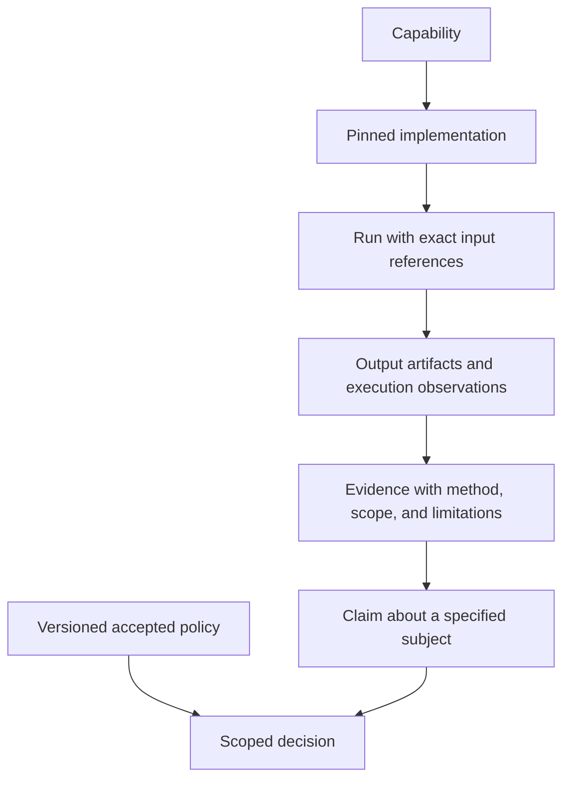

The shared kernel gives every domain the same way to identify a subject, select its exact version, and describe evidence about it. Without this common law, a dataset name, checkpoint label, and deployment tag could each appear stable while selecting different bytes. Shared references allow reviewers and future replay machinery to follow an exact chain without treating a name or URL as proof.

This is an explanatory glossary and design reference. `core/` provides partial Rust value types; it does not provide a durable store, policy evaluator, credential issuer, or scientific qualification system. Consult [maturity](https://github.com/Mindclade-org/mindclade-internal-monorepo/blob/main/docs/architecture/maturity.yaml) and the [agent handoff](developer/agent-handoff) for scope. Examples below explain relationships; they are not new schemas, serialization formats, or APIs.

## Identity is not content or location

| Term | Meaning | Boundary |
| --- | --- | --- |
| Identity | A namespaced, named, versioned subject. | A human-readable name alone is insufficient to identify bytes or prove eligibility. |
| Revision | The selected version of the named subject. | A newer revision is a different input; it cannot silently replace the one an assessment used. |
| Digest | Content identity for exact bytes under the declared algorithm. | Hash equality is not authorship, safety, scientific truth, or permission. |
| `Reference<T>` | Identity and digest constrained to a kernel-defined target kind. | A typed reference rejects a wrong kind; constructing it does not retrieve or authenticate the object. |
| Heterogeneous reference | A checked tagged reference when the subject may have several legitimate kinds. | It is not an escape hatch for an unchecked generic target. |
| Location | A path, registry address, or other retrieval hint. | Availability can change without changing semantic identity; retrieval must verify the expected content. |
| Graph snapshot | Immutable compiled meaning, addressed by exact graph identity/content. | Runtime observations do not mutate the sealed snapshot. |

The [identity implementation](https://github.com/Mindclade-org/mindclade-internal-monorepo/blob/main/core/src/identity.rs) validates namespace, name, and version components and SHA-256 digest representation. The [reference implementation](https://github.com/Mindclade-org/mindclade-internal-monorepo/blob/main/core/src/reference.rs) fixes target kinds in sealed marker types and checks them on deserialization and conversion. Consult these sources and [kernel tests](https://github.com/Mindclade-org/mindclade-internal-monorepo/blob/main/core/tests/kernel.rs) for exact admitted syntax and supported behavior; this glossary is deliberately not a duplicate wire specification.

Future transport bindings must preserve these invariants. A JSON object with familiar property names is not automatically a checked kernel reference. Exact cross-language value and reference semantics remain part of the [compiler completion work](https://github.com/Mindclade-org/mindclade-internal-monorepo/blob/main/docs/superpowers/plans/2026-09-23-foundation-compiler-completion.md). Generated bindings preserve the contract at transport boundaries; handwritten product helpers and domain implementations remain separately owned. The [generated-surface ownership ledger](https://github.com/Mindclade-org/mindclade-internal-monorepo/blob/main/docs/architecture/generated-surface-ownership.md) identifies those boundaries without turning helpers into competing semantic definitions.

## The shared vocabulary

| Primitive | Design role and present source | What its presence does not establish |
| --- | --- | --- |
| Artifact | Immutable content with identity, kind, digest, and provenance; [source](https://github.com/Mindclade-org/mindclade-internal-monorepo/blob/main/core/src/artifact.rs). | A content-addressed store, signature verification, or a populated scientific artifact catalogue. |
| Capability | Declares an operation with ownership and policy reference; [source](https://github.com/Mindclade-org/mindclade-internal-monorepo/blob/main/core/src/capability.rs). | Credentials or a grant to execute the operation. |
| Implementation | Identifies how a capability is realized and references its source artifact; [source](https://github.com/Mindclade-org/mindclade-internal-monorepo/blob/main/core/src/implementation.rs). | Eligibility for every tenant, environment, or scientific task. |
| Run | Records execution identity and links capability, implementation, inputs, outputs, and evidence; [source](https://github.com/Mindclade-org/mindclade-internal-monorepo/blob/main/core/src/run.rs). | Scheduling, retry, durable state transitions, budget enforcement, or successful execution. |
| Evidence | Observed material about a subject, attributable to its producing Run; [source](https://github.com/Mindclade-org/mindclade-internal-monorepo/blob/main/core/src/evidence.rs). | The truth of every claim that cites it, or adequacy for another qualification lane. |
| Claim | An assertion about an explicit subject with supporting evidence references; [source](https://github.com/Mindclade-org/mindclade-internal-monorepo/blob/main/core/src/claim.rs). | An accepted fact merely because the assertion is stored. |
| Policy | Versioned scope and rule input for assessment; [source](https://github.com/Mindclade-org/mindclade-internal-monorepo/blob/main/core/src/policy.rs). | A policy engine or proof that the policy was independently accepted. |
| Decision | Binds a claim and policy to an outcome; [source](https://github.com/Mindclade-org/mindclade-internal-monorepo/blob/main/core/src/decision.rs). | Authority beyond that policy, subject, environment, and scope. |
| Provenance | Attribution and source linkage for a record; [source](https://github.com/Mindclade-org/mindclade-internal-monorepo/blob/main/core/src/provenance.rs). | Complete trusted custody, authenticity, or transitive completeness of the whole lineage. |

The constructors are a bounded semantic foundation. Full service state machines, domain validation, receipt formats, and runtime enforcement must be implemented and tested in their owning slice. In particular, the current `Provenance` record is not the complete engineering or scientific receipt described by the blueprint.

## From execution to a scoped decision

This is a conceptual relationship, not a running engine. Evidence can support or contradict a claim. An observed test pass supports the tested source behavior; it does not establish deployment or biological accuracy. An immutable record can preserve an incorrect assertion faithfully. Assessment therefore needs relevant evidence, independent criteria, explicit limitations, and an attributable decision.

A model registered by digest remains a registered artifact until an applicable decision establishes eligibility for a specified use. Release signing, deployment promotion, and scientific support are different decisions. A decision for one benchmark, tenant, or environment cannot be reused as universal acceptance.

## Engineering and scientific lineage

The [provenance requirements](https://github.com/Mindclade-org/mindclade-internal-monorepo/blob/main/docs/architecture/provenance-requirements.md) own the full target receipt fields. The two chains share kernel identities but answer different questions.

| Chain | What it must let a reader recover | Important separation |
| --- | --- | --- |
| Engineering | Requirement, specification/ADR, contract, source revision, generator and output, evaluator, build, release, deployment, and later operational feedback. | A source result may explicitly exclude deployment, signing, and runtime evidence; absent fields are not invented to imply a complete release. |
| Scientific | Source and permitted use, raw content, curation, biological meaning, dataset/split, features, protocol, model/checkpoint, evaluator, and scoped claim. | Retrieval, measurement, simulation, and inference remain distinguishable; execution success is not scientific support. |

For example, a planned inference result should let an assessor resolve the exact input artifact, model, and checkpoint, operator/environment identity, producing Run, and evaluation context. If the input dataset or evaluator changes, the old result remains attributable but does not answer the new question. A future engineering receipt similarly binds the tested candidate and base, rather than substituting a later branch tip because the branch name stayed the same.

Canonical generated bytes and variable execution receipts also differ. The [foundation manifest](https://github.com/Mindclade-org/mindclade-internal-monorepo/blob/main/generated/README.md) binds deterministic source, graph, generator, and output identities. Host, executing revision, and wall-clock receipt data describe an execution without making time part of semantic identity.

## Failures, corrections, and availability

| Situation | Required interpretation in the target design |
| --- | --- |
| Wrong reference kind or malformed identity/digest | Reject at the checked boundary; do not coerce the value into a different subject. |
| Retrieved content differs from the expected digest | Treat it as invalid for that reference; retain the failure rather than silently choosing new bytes. |
| Required artifact or evidence is unavailable | The dependent claim is blocked; a reference's existence does not prove retrievability. |
| Evidence was produced for another candidate, dataset, or policy | Preserve its historical scope; obtain fresh applicable evidence for the changed inputs. |
| Source assertion or measurement is corrected | Add an attributable new version or superseding record; preserve the prior record and reason. |
| Execution succeeds but an evaluator is inconclusive | Preserve the execution result and assessment limitation separately; do not convert either into scientific acceptance. |

Retention, access controls, signatures, independent custody, and replay are needed where the claim depends on them. The [evidence-retention guide](https://github.com/Mindclade-org/mindclade-internal-monorepo/blob/main/docs/architecture/evidence-retention.md) distinguishes existing local source export/readback from the still incomplete operational archive. A digest written by an untrusted producer is an observation, not authentication of that producer or its execution environment.

## Keep engineering governance records separate

[WorkPacket@v1](https://github.com/Mindclade-org/mindclade-internal-monorepo/blob/main/docs/developer/work-packet-v1.md) and GovernanceReport@v1 are non-semantic engineering records. They bind scope and observations but are not kernel capabilities, graph inputs, path locks, accepted policy Decisions, or execution grants. Their schema names and statuses belong to the engineering contract, not this glossary. Do not merge the governance check statuses, kernel decision outcomes, future scientific assessment outcomes, or runtime lifecycle states into one convenient success field.

Operational admission requires independently approved inputs and trusted evaluator execution under the [supervised workflow](https://github.com/Mindclade-org/mindclade-internal-monorepo/blob/main/.agents/workflows/supervised.md). Writing provenance or producing a passing local report cannot bootstrap those permissions.

## Related

<CardGroup cols={2}>
  <Card title="ADR-004: Identity law" icon="chevron-right" href="/architecture/adr/adr-004-identity-reference-and-artifact-law">
    Identity, reference, and artifact law.
  </Card>

  <Card title="ADR-005: Evidence law" icon="chevron-right" href="/architecture/adr/adr-005-evidence-claim-policy-and-decision-law">
    Evidence, claim, policy, and decision law.
  </Card>

  <Card title="Semantic compilation" icon="chevron-right" href="/architecture/foundations/semantic-compilation">
    Generated identity and contract semantics.
  </Card>

  <Card title="Scientific and agent planes" icon="chevron-right" href="/architecture/foundations/scientific-and-agent-planes">
    Domain lineage across biology, data, and models.
  </Card>
</CardGroup>
