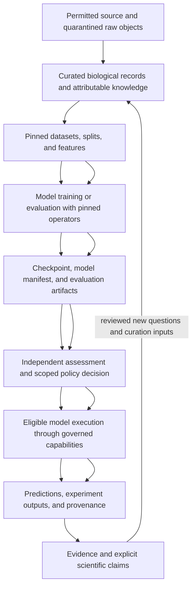

This page explains how biological meaning, data, models, learning, compute, and agents are separated and how their evidence stays visible. It is for scientific software developers, model/ and how their evidence stays visible. It is for scientific software developers, model/data authors, reviewers, and agents planning a bounded domain slice.

<Warning>
  This is a target design. Biological semantics, ingestion, knowledge, models, learning, model execution, and the scientific agent runtime remain planned. Their scaffolded paths do not supply real capabilities or scientific qualification. [Maturity](https://github.com/Mindclade-org/mindclade-internal-monorepo/blob/main/docs/architecture/maturity.yaml) and the [current handoff](/developer/agent-handoff#current-task-register) owna target design. Biological semantics, ingestion, knowledge, models, learning, model execution, and the scientific agent runtime remain planned. Their scaffolded paths do not supply real capabilities or scientific qualification. [Maturity](https://github.com/Mindclade-org/mindclade-internal-monorepo/blob/main/docs/architecture/maturity.yaml) and the [current handoff](/developer/agent-handoff#current-task-register) own implementation and work status. The vocabulary below does not freeze new wire contracts, choose a model checkpoint, or authorize source acquisition.
</Warning>

Mindclade separates biological meaning, data preparation, mathematical models, learning, execution, and scientific assessment. Each plane contributes to one traceable scientific question. None can replace missing evidence from another plane with a successful API response or a matching tensor shape.

Mindclade separates biological meaning, data preparation, mathematical models, learning, execution, and scientific assessment. Each plane contributes to one traceable scientific question. None can replace missing evidence from another plane with a successful API response or a matching tensor shape.

## Domain boundaries and exchanges

The paths are ownership destinations, not required microservices. Typed ports, immutable references, and generated interfaces connect them; the initial deployment remains modular-monolith-first.

| Plane or substrate | Owner and inputs | Outputs and boundary |
| --- | --- | --- |
| Biological semantics | `biology/`; source observations, mappings, units, conditions,, and entity identities. | Canonical entities, states, relationships,, and measurement meaning independent of transport or ML vendors. |
| Knowledge | `data/knowledge/`; permitted literature/source records, passages,, and biological mappings. | Attributable assertions, retrieval indexes, supporting/conflicting evidence,, and revision history. A knowledge graph is domain data, not compiler authority. |
| Data and features | `data/`; approved raw inputs, curation transforms, schema,, and feature definitions. | Versioned snapshots, split manifests, features, quality,, and lineage artifacts; no implicit scientific endorsement. |
| Compute | `compute/`; tensor/operator contracts and declared device/topology requirements. | Reference and optimized execution mechanics, numerical parity,, and performance evidence within measured scope. |
| Models | `models/`; biological/tensor contracts and model configuration. | Mathematical definitions, representation interfaces,, and model-specific compatibility rules; no training loop or orchestration ownership. |
| Training and evaluation | `ml/`; pinned data/splits, models, objectives, operators,, and evaluator inputs. | Checkpoints, run records,, and evaluation evidence. Independent assurance owns acceptance of scientific claims. |
| Model runtime | `runtime/`; eligible pinned model/checkpoint artifacts and typed inference inputs. | Predictions, embeddings,, or other outputs plus execution context; does not redefine model mathematics or depend on training loops. |
| Experiments | `platform/experiments/` and `services/experiment_service/`; protocols, interventions, controls,, and admitted execution requests. | Measurements, observations,, and deviations with explicit measured/simulated/inferred status. Laboratory integration requires separate authority. |
| Agents | `agents/`; scoped objectives, allowed capabilities, retrieved context,, and budgets. | Proposed plans and authorized invocations with session/tool provenance; agent text is not scientific evidence by itself. |

The Science Plane in the overview groups biological, knowledge, data, and experiment concerns. The Model Plane groups model definition and its learning/evaluation interfaces. The Agent Plane coordinates permitted workflows across them. The lower data/features, training/eval, and inference boxes describe execution responsibilities, not a second set of competing domain owners.

## One scientific lifecycle

This target flow is not an automatic approval chain. A model can be registered before it is eligible; an eligibility decision is not deployment promotion; an inference result is not confirmation of a biological hypothesis. Feedback creates new attributable records and reviewed changes rather than overwriting the dataset, model, or evaluator that produced earlier evidence.

## Meaning at the biological and tensor boundaries

The [programmable-biology design](/architecture/programmable-biology) uses BiologicalState, Intervention, Condition, Observation, and TensorBundle as candidate vocabulary. These are not yet implemented TypeSpec schemas. A concrete slice must define its admitted fields, units, compatibility, fixtures, and acceptance before use.

Biological meaning includes subject identity, scale, time, units, coordinate systems, assay conditions, uncertainty, and observed versus inferred status. A transform to tensors additionally preserves axes, shape, dtype, masks, missingness, preprocessing, and operator versions. Tensor compatibility cannot repair an ambiguous biological identity or incompatible measurement unit.

An embedding carries its encoder/checkpoint reference, modality, granularity, normalization, and supported scope. Two embeddings of equal dimensions need not share meaning. Cross-scale molecular-to-cellular or cellular-to-systems bridges require explicit mappings, calibration, and held-out evidence for the proposed claim. A shared architecture does not force every modality into one latent space.

## Data and knowledge are evidence-bearing inputs

Source adoption records access permission, licence, intended use, raw content digest, release/version, and retention constraints before a dataset is used. Public availability alone does not establish permitted use. Raw/quarantined content is distinct from curated records and from approved training/evaluation inputs.

Dataset snapshots bind transforms, biological mappings, quality checks, and split manifests. Deduplication, cross-source overlap, and temporal or biological family/cluster leakage checks depend on the claim. A deterministic fixture must remain pinned; replacing it with a fresh network result invalidates reproducibility. Leakage checkers themselves need contaminated fixtures that demonstrate detection.

Knowledge assertions retain exact source passages, extraction version, entity ambiguity, claim scope, contradictions, and retractions. Retrieval relevance means an item may help answer a query; it does not establish evidentiary support for the answer. Corrections and retractions supersede records while preserving their history and downstream lineage.

## Models, learning,, and compute have separate acceptance

Models describe mathematics. Learning selects objectives and training procedures and records data/split/checkpoint/operator/environment identities. Runtime executes a pinned eligible artifact without importing training-loop authority. Compute owns the mechanics underneath these consumers.

The accepted native direction uses explicit operator contracts, CPU reference behavior, forward/gradient tolerances, and generated C ABI boundaries. Future TileLang optimization follows a measured need and numerical acceptance. Triton and `tch-rs` are not baseline dependencies. A fake CPU implementation cannot prove GPU throughput, multi-device behavior, or biological accuracy.

Scientific evaluators are validated and frozen before a campaign. Dataset/split, scorer, thresholds, exclusions, seeds/repetitions where relevant, judge versions, and acceptance-query allowances belong to the reviewed evaluation boundary. Protected holdouts remain separate from candidate development. A candidate that fails cannot change its evaluator or threshold and present the same assessment as passed.

Execution state and scientific assessment differ. Failed runs, negative results, inconclusive outcomes, deviations, uncertainty, sample counts, and matched baseline comparisons remain part of the record. Source review, numerical parity, scientific support, release eligibility, and environment behavior each need evidence for their own scope.

## Agents coordinate permitted work

The planned `agents/` runtime owns sessions, context, memory, planning, tools, orchestration, approvals, sandboxing, and adapters. Repository [`.agents/`](https://github.com/Mindclade-org/mindclade-internal-monorepo/blob/main/.agents/README.md) instead contains development instructions and supervised workflow sources. Installing or reading those instructions does not create a running agent platform.

An agent should discover capabilities through generated descriptions and invoke their implementations through allowed generated interfaces rather than reach into model internals or persistent state. Domain implementations and product runtime helpers are handwritten; generated bindings do not create those behaviors. The [generated-surface ownership ledger](/architecture/generated-surface-ownership) records that separation. An agent's scope includes owned paths, allowed tools, credentials, network policy, budget, and stop conditions. Child agents inherit no authority automatically. A generated MCP tool description is a discovery surface, not an execution grant.

Retrieved literature, web content, model responses, and tool results are untrusted inputs. They cannot modify the caller's permissions, acceptance criteria, or source authority. Session and invocation provenance must preserve which actor requested which capability, with what admitted inputs and constraints. These target controls follow [ADR-011](/architecture/adr/adr-011-agent-capability-attenuation); actual supervised development follows the [developer workflow](/developer/supervised-development).

## Failures and evidence that must remain visible

| Failure boundary | Preserve and resolve before a stronger claim |
| --- | --- |
| Missing licence, source identity,, or permitted-use context | Block the affected adoption/use; do not substitute public reachability for permission. |
| Ambiguous entity, incompatible unit,, or missing condition | Record uncertainty/rejection in curation; do not silently coerce biological meaning. |
| Leakage or contaminated holdout | Invalidate the affected scientific assessment and review split/evaluator revisions. |
| Unsupported operator, numerical deviation,, or incompatible checkpoint | Restrict execution/eligibility to the proven scope; no automatic fallback with unchanged provenance. |
| Timeout, interruption,, or uncertain external effect | Reconcile the actual Run/attempt/provider state before retry; a client timeout is not proof of no effect. |
| Missing artifact, evaluator evidence,, or custody | Block the dependent qualification claim; preserve the narrower result that is actually supported. |
| Agent exceeds scope or receives conflicting retrieved instructions | Stop the affected action under the task's rules; retrieved text cannot grant additional authority. |

The planned platform supplies durable attempts, budget accounting, effect reconciliation, and cancellation; the model runtime does not invent another queue or retry authority. Use [execution reliability](/architecture/execution-reliability) for those mechanisms. Observability must let an operator connect request/session, Run/attempt, and artifact/evaluator identities without placing secrets or unrestricted scientific payloads in logs; exact telemetry contracts remain implementation work.

## Development order

Complete the bounded engineering and VS-001 foundation before a scientific vertical. The accepted scientific sequence then starts protein-first with approved, pinned local fixtures, biological identity, curation/lineage, split checks, and a representation baseline. Clade-Embed is a capability over shared representation machinery, not another encoder stack. Additional cellular, systems, and multiscale roles require matched held-out evidence; dense baselines precede added mixture-of-experts complexity. Catalogue names do not choose an adopted checkpoint or release.

This sequence is design context, not a new task assignment. The [implementation roadmap](/architecture/implementation-roadmap) and current handoff retain ordering and open gates.

## Related

<CardGroup cols={2}>
  <Card title="ADR-006ADR-006" icon="file-text" href="/architecture/adr/adr-006-biological-world-model-authority">
    Biological world model authorityBiological world model authority.
  </Card>

  <Card title="ADR-007ADR-007" icon="file-text" href="/architecture/adr/adr-007-compute-models-learning-and-runtime-boundaries">
    Compute, models, learning, and runtime boundariesCompute, models, learning, and runtime boundaries.
  </Card>

  <Card title="Programmable BiologyProgrammable Biology" icon="dna" href="/architecture/programmable-biology">
    Candidate vocabulary for biological states, interventions, and observationsCandidate vocabulary for biological states, interventions, and observations.
  </Card>

  <Card title="Provenance Requirementsvenance Requirements" icon="list-check" href="/architecture/provenance-requirements">
    Full target receipt fields for engineering and scientific lineageFull target receipt fields for engineering and scientific lineage.
  </Card>

  <Card title="Kernel and Provenance" icon="shield" href="/architecture/foundations/kernel-and-provenance">
    Shared identity, evidence, and assessment semantics.
  </Card>

  <Card title="System Context" icon="sitemap" href="/architecture/foundations/system-context">
    Complete ownership map.
  </Card>

  <Card title="Kernel and Provenance" icon="shield" href="/architecture/foundations/kernel-and-provenance">
    Shared identity, evidence, and assessment semantics.
  </Card>

  <Card title="System Context" icon="sitemap" href="/architecture/foundations/system-context">
    Complete ownership map.
  </Card>
</CardGroup>
