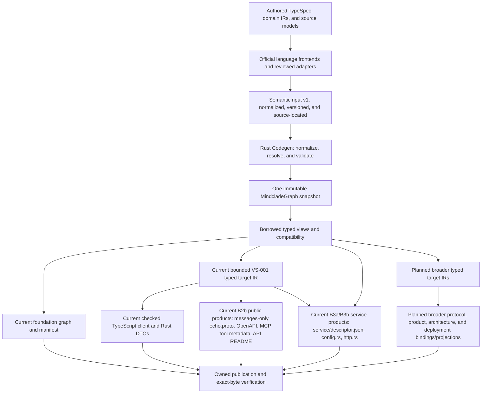

This page explains how Codegen turns authored contracts into one immutable graph and generated product surfaces, and how a change to them is reviewed. Audience includes contract authors, compiler/product developers, and reviewers. The official TypeSpec frontend, Rust compiler, immutable graph, and foundation graph/manifest projection are partial source implementations. Bounded VS-001 typed target IR, checked TypeScript clients, and Rust DTOs are implemented. The bounded VS-001 B2b public products (messages-only Protobuf, OpenAPI, MCP tool metadata, and API docs) and B3a/B3b service products (descriptor, configuration, and HTTP adapter) are source checkpoints. Full frontend coverage, broader target IRs/products, and architecture/deployment products remain incomplete or planned; consult [maturity](/architecture/maturity) and the [current handoff](/developer/agent-handoff). This page defines no new wire schema, frontend feature, or generator destination.

Codegen translates authored meaning into consistent product surfaces. It is the only semantic compiler. Generated SDK bindings, protocols, MCP metadata/bindings, and deployment views must agree because each derives from the same validated meaning, rather than each interpreting TypeSpec, YAML, or domain text independently. Handwritten product helpers and domain implementations supply behavior around those generated interfaces.

## Inputs, graph, and projections

The graph does not contain a separately editable Semantic Graph followed by a separately authoritative Capability Graph. These are typed views of one immutable snapshot under [ADR-003](/architecture/adr/adr-003-mindcladegraph-and-typed-graph-views). The current [graph source](https://github.com/Mindclade-org/mindclade-internal-monorepo/blob/main/codegen/src/graph.rs) exposes borrowed Semantic, Capability, and Public views, plus bounded B3a Architecture and Services views. Broader assurance, provenance, and deployment concerns remain planned. Existing names and reserved directories do not implement those broader views.

The historical Forge name resolves to `codegen/`; it does not identify another compiler root. Scientific knowledge graphs hold versioned assertions and records under compiled schemas, rather than replacing MindcladeGraph.

For TypeSpec-owned APIs, Codegen generates Protobuf through the graph and target IR; Protobuf is not a parallel authored contract. `contracts/protobuf/` is reserved for an optional, planned Proto-first frontend only when a reviewed contract has explicitly disjoint ownership from TypeSpec. The same contract must never be authored in both languages, and generated Protobuf must never round-trip into authored input. Neither that optional frontend nor Protobuf emission beyond VS-001's messages-only `echo.proto` is implemented by the present foundation. See the [generated-surface ownership ledger](/architecture/generated-surface-ownership) for the source, binding, helper, and output responsibilities of each surface.

## Responsibility at each boundary

| Boundary | What it owns | What it must not infer downstream |
| --- | --- | --- |
| Authored contract | Intentional interface, resource, scientific, agent, or operator meaning, with ownership and versioning. | Generated output cannot be imported back as authored authority. |
| Language frontend | Consume the official compiler's resolved language/HTTP meaning and retain source locations. | A second parser must not independently reconstruct TypeSpec semantics. |
| SemanticInput | Versioned normalized input, declarations, and source provenance admitted by the compiler. | A supported language construct is not automatically a supported Mindclade input. |
| Rust compiler | Validate identities, references, relationships, visibility, and supported platform meaning; seal the snapshot. | Unsupported or unresolved meaning cannot be silently dropped to permit emission. |
| Typed graph view | Select a concern from that same snapshot. | A view does not own another mutable truth store. |
| Compatibility | Compare graph meaning for the declared direction and supported consumers. | Matching rendered text does not prove semantic compatibility. |
| Target IR and emitter | Express validated meaning in a target representation and emit deterministic products. | An emitter cannot reopen authored inputs to reinterpret their meaning. |
| Product runtime/helper | Supply reviewed runtime behavior or ergonomics around generated bindings. | Authored helpers cannot alter the contract or erase reference validation. |

TypeSpec's official [emitter documentation](https://github.com/microsoft/typespec/blob/main/website/src/content/docs/docs/extending-typespec/emitters-basics.md) describes the compiler Program and resolved type graph. That public reference supports the conceptual frontend boundary. The repository's locked dependencies, [adapter source](https://github.com/Mindclade-org/mindclade-internal-monorepo/blob/main/codegen/frontend/typespec/src/index.mjs), and tests govern the actual supported APIs and behavior; upstream documentation is not permission to upgrade pins or add an emitter framework.

## What the foundation source actually provides

The original bounded Echo path consumes named models and HTTP operations through the official TypeSpec adapter. The expanded declaration path adds public/internal source ownership and richer declarations; it lives in [frontend declarations](https://github.com/Mindclade-org/mindclade-internal-monorepo/blob/main/codegen/frontend/typespec/src/declarations.mjs), [normalized declaration types](https://github.com/Mindclade-org/mindclade-internal-monorepo/blob/main/codegen/src/frontend/declarations.rs), and [visibility validation](https://github.com/Mindclade-org/mindclade-internal-monorepo/blob/main/codegen/src/visibility.rs). These paths are bounded subsets, not full TypeSpec or HTTP support. Use their diagnostics and fixtures when changing a construct instead of treating this page as a feature matrix.

The Rust [pipeline](https://github.com/Mindclade-org/mindclade-internal-monorepo/blob/main/codegen/src/pipeline.rs) and graph builder validate normalized input before sealing it. Source locations support actionable errors; invalid references, duplicate identities, and invalid relationships do not become partially trusted output. The [compatibility implementation](https://github.com/Mindclade-org/mindclade-internal-monorepo/blob/main/codegen/src/compatibility.rs) includes directional old-client/new-server comparisons and expanded declarations. Unknown pattern relationships, unsupported changes, and incompatible representations remain non-passing. This is not universal compatibility across future model, dataset, checkpoint, operator, or deployment contracts.

The original foundation pair is [graph.json](https://github.com/Mindclade-org/mindclade-internal-monorepo/blob/main/generated/foundation/graph.json) and [manifest.json](https://github.com/Mindclade-org/mindclade-internal-monorepo/blob/main/generated/foundation/manifest.json). B2a also emits the original seven [VS-001 products](https://github.com/Mindclade-org/mindclade-internal-monorepo/blob/main/generated/README.md#vs-001-products-vs001transportprofilev1) with real TypeScript and Rust consumers. Its [source checkpoint](/architecture/reviews/2026-09-23-vs001-products) records that historical checkpoint. B3a extends the active service catalog to nine files with checked descriptor and configuration projections, as recorded in the [service checkpoint](/architecture/reviews/2026-09-23-vs001-service-compilation). Root `generated/MANIFEST.json`, `generated/PROVENANCE.jsonl`, reserved architecture models, SDK folders, and service descriptors remain explicit placeholders where listed in the scaffold manifest. A plausible filename is not generation evidence.

## Authored and generated product boundaries

The following destinations describe the accepted target. Beyond the bounded foundation and VS-001 inventories above, they are not claims of installable products.

| Surface | Authored owner and generated boundary | Acceptance concern |
| --- | --- | --- |
| Protocols | TypeSpec-owned APIs produce Protobuf and other protocol projections under `protocols/` and declared `generated/` targets. Optional future Proto-first inputs require disjoint ownership under `contracts/protobuf/`. | No dual-authored contract or generated-input round trip; supported wire behavior, compatibility, audience, and independently expected responses. |
| SDKs and CLI | Product ergonomics/runtime helpers under `products/`; emitted bindings under declared generated destinations. | Real consumer compilation/installation, error behavior, and exact-reference preservation. |
| MCP | Authored runtime and adapters under `products/mcp/`; generated descriptions/bindings where declared. | Tool discovery is separate from invocation authorization, tenant scope, and result evidence. |
| Terraform and CDK | Authored infrastructure intent and product helpers; synthesized projections from modeled deployment meaning. | Desired-state lifecycle and drift are tested explicitly; an imperative Run is not automatically a resource. |
| Service bindings | Authored domain implementation and descriptor; generated transport and checked configuration. | Real client-to-service conformance and explicit identity, limits, errors, and shutdown. |
| Native C ABI | Operator contracts drive generated native interfaces and registration boundaries. | Numerical parity and supported shape/dtype/device behavior remain separate from ABI compilation. |
| Documentation and architecture | Authored narrative/source models; generated API and architecture views. | Source/path/owner/maturity links and exact drift checks; an illustrative poster is not a generated atlas. |
| Deployment bundles | Authored environment intent and descriptors; Deployment IR and generated bundles. | Qualification, signing, and promotion precede connected GitOps verification. |

## Lifecycle of a generated surface

<Steps>
  <Step title="Freeze the source boundary">
    Identify the contract, descriptor, or reviewed architecture source, its owner, visibility, and exact input versions. A scaffold transition is reviewed before a placeholder becomes a genuine output.
  </Step>
  <Step title="Compile once">
    Use the supported frontend and Codegen validation. Retain diagnostics; a missing or unsupported semantic requirement blocks that product.
  </Step>
  <Step title="Check compatibility and audience">
    Compare the appropriate graph versions and close public dependencies transitively. Fields, referenced types, errors, examples, and product destinations cannot leak internal meaning into a public surface.
  </Step>
  <Step title="Emit into explicit ownership">
    Declare complete output inventory, generator identity, policy, deterministic bytes, and stale-file handling. Keep authored product code outside disposable zones.
  </Step>
  <Step title="Publish recoverably">
    Verify input and generator identities, handle interrupted writes within owned paths, and make incomplete publication detectably invalid. The current foundation publisher is a recoverable multi-file protocol with a journal and manifest-last publication, not an atomic whole-directory rename.
  </Step>
  <Step title="Verify and consume">
    Read-only exact-byte checking detects drift; independent expected behavior and actual consumers test meaning beyond the emitter's own output. A generator and mock repeating the same mistake are insufficient.
  </Step>
  <Step title="Retain evidence and qualify the claimed scope">
    Bind input, graph, generator, output, and evaluator identities. A fresh source check does not become release, deployment, or scientific acceptance.
  </Step>
</Steps>

The [generated-output policy](/architecture/generated-output-policy) and [foundation output contract](https://github.com/Mindclade-org/mindclade-internal-monorepo/blob/main/generated/README.md) own the exact implemented manifest, publication, and receipt behavior. Canonical semantic bytes exclude variable envelope data such as wall-clock time; generation receipts retain execution context separately. The current publisher's process-recovery evidence does not establish power-loss, hostile concurrent mutation, or network-filesystem guarantees.

Future multi-registry release sets are also not atomic. The [developer-product requirements](/architecture/developer-products) call for immutable component versions, required-product qualification, and reconciliation of partial publication before discovery pointers advance. Recovery selects a compatible prior set or publishes a corrective version; it does not overwrite history.

## Failure and change review

An unsupported frontend construct is repaired at the authored contract or reviewed frontend boundary. A graph error is repaired before lowering. A product discrepancy requires an independently expected case that distinguishes compiler meaning from emitter/runtime behavior. A drift failure is investigated against source and generator identity; hand-editing output or resealing a changed placeholder cannot resolve it.

Changing a contract, generator, lock, policy, or candidate invalidates affected evidence until regeneration, checks, and review bind the new inputs. Commands and execution ownership live in [start here](/developer/start-here); this reference does not add a generator command or authorize production publication.

## Implemented wire admission limit

Canonical artifact JSON admits at most 127 nested arrays or objects, counting empty containers. A scalar inside the 127th container is allowed; a 128th container is rejected. The compiler reference and generated Rust retain the pinned parser recursion guard; generated TypeScript applies the same limit. This bounded profile and its cross-language regression corpus do not establish contract-owner baseline acceptance or qualify arbitrary future consumers.

## Related

<CardGroup cols={2}>
  <Card title="System Context" icon="map" href="/architecture/foundations/system-context">
    Where compiled products fit in repository ownership and target boundaries.
  </Card>

  <Card title="Kernel and Provenance" icon="fingerprint" href="/architecture/foundations/kernel-and-provenance">
    Shared identity and evidence semantics that generated surfaces preserve.
  </Card>

  <Card title="Generated Output Policy" icon="file-shield" href="/architecture/generated-output-policy">
    Exact manifest, publication, drift, and receipt behavior.
  </Card>

  <Card title="VS-001 Semantic Loop" icon="arrows-rotate" href="/architecture/vs-001-semantic-development-loop">
    Bounded design and current task register for the first capability loop.
  </Card>
</CardGroup>
