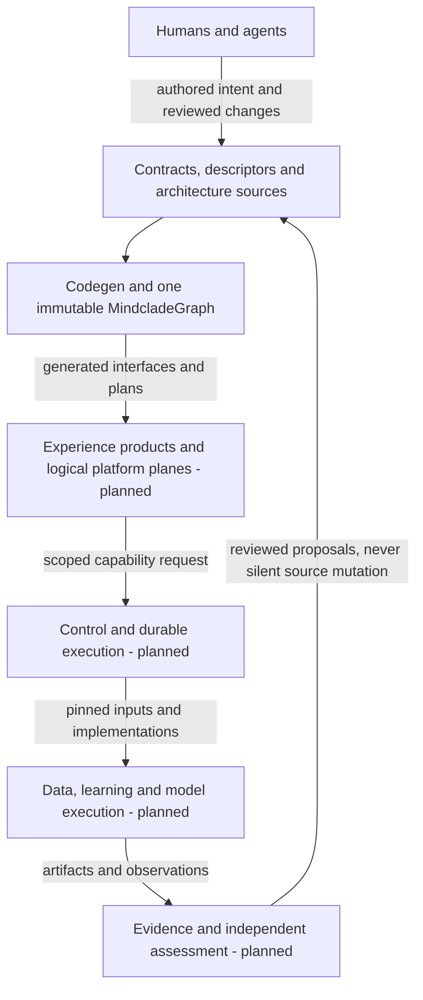

This page shows how the parts of the target system relate, who owns each root, and where a change belongs. It is an explanatory reference for the accepted target architecture. The kernel, TypeSpec frontend, and compiler have partial source implementations; the scientific platform and execution layers below remain planned. This page grants no activation or execution authority. [Maturity](/architecture/maturity) records implementation scope; the [agent handoff](/developer/agent-handoff) records current work and gates.

Mindclade connects authored scientific and engineering intent to governed execution and attributable evidence. The repository owns the contracts and domain meaning. Compilers produce interfaces and deployment projections; services execute pinned capabilities; separate evaluators assess their results. A dashboard, model provider, or cloud account is an integration boundary, not a second semantic authority.

## Read the target as three related views

The layered [platform diagram](/architecture/platform-diagram) combines three views. They are not three applications or percentages of completed implementation.

| View | Question it answers | Main boundary |
| --- | --- | --- |
| Semantic compilation | What does the platform mean, and which interfaces follow from that meaning? | Authored contracts enter Codegen; generated products cannot redefine them. |
| Platform and execution | How does an admitted operation reach data, models, or compute and return a result? | Logical planes use control and durable execution; deployment boundaries remain minimal. |
| Shared laws and delivery | How are identity, evidence, service behavior, assurance, and release kept consistent? | Shared primitives and separately scoped decisions apply across every plane. |

Arrows show intended information flow. They do not authorize calls, imply a running service, or describe imports. Execution fabric and cloud substrate support the execution boxes; they do not sit above contracts in the authority order.

## Map the diagram to repository ownership

The table maps every major target layer to its owning paths. Paths may be reserved scaffold. A logical plane can span several packages and share a process with other planes under the modular-monolith-first decision.

| Target box | Owning paths and interaction | Current boundary |
| --- | --- | --- |
| Authoring | `contracts/typespec/`, domain IRs under `contracts/science/`, `contracts/agents/`, `contracts/operators/`, and source models including descriptors, registries and architecture sources. | TypeSpec has a bounded foundation path; other authoring adapters are planned. |
| SemanticInput and Codegen | `codegen/` adapts official language semantics, validates normalized input and seals the graph. | Partial Rust/compiler and official TypeSpec source. |
| Immutable graph and typed views | `codegen/src/graph.rs`; Semantic, Capability, Public and bounded B3a Architecture/Services views borrow one snapshot. Broader views remain planned. | Partial; no separate Capability Graph database or compiler. |
| Target IR and generated surfaces | `codegen/ir/`, `codegen/lowering/`, `generated/`, `protocols/` and declared generated product subtrees. | Foundation graph/manifest and bounded VS-001 TypeScript/Rust emission exist; broader IRs and products are planned. |
| Experience | `products/console/`, `products/admin/`, `products/cli/`, `products/sdk/`, `products/mcp/`, `products/docs_site/`, `products/design_system/`. | Planned consumers of public, governed interfaces. |
| Agent plane | `agents/` and `services/agent_service/`; capability discovery, sessions, tools, context and approvals. | Planned runtime; distinct from repository `.agents/` instructions. |
| Science plane | `biology/`, `data/knowledge/`, `platform/experiments/` and domain capabilities. | Planned biological meaning, attributable knowledge and experimental workflows. |
| Model plane | `models/`, `models/registry/`, `ml/` and model manifests. | Planned definitions, learning and evaluation; registration is not qualification. |
| Control plane | `platform/control/`, `platform/authorization/`, `platform/policy/`, `platform/budgets/`, `platform/tenancy/`. | Planned admission, jobs, ownership and reconciliation. |
| Durable runtime | `platform/persistence/`, `platform/events/`, `platform/workflow/`, `platform/scheduler/` and control state. | Planned PostgreSQL state plus transactional outbox, attempts and fencing. |
| Data / features | `data/` and `data/features/`; source records become curated snapshots and versioned features. | Planned; external access and permitted use require their own decisions. |
| Training / evaluation | `ml/`; pinned data, operators and model definitions produce checkpoints and evaluation artifacts. | Planned; independent assurance remains separate. |
| Inference | `runtime/` with `models/` and `compute/`; execute eligible, pinned model artifacts. | Planned model execution, not the durable orchestration owner. |
| Execution fabric | `compute/`, `infra/kubernetes/`, `infra/clusters/`, `infra/gpu/`; CPU/GPU mechanics and target Kubernetes topology. | Planned beyond bounded compiler/build execution. |
| Cloud substrate | `infra/clusters/gcp/`, `infra/clusters/azure/` and related authored infrastructure. | GCP/Azure are target adapters; no connected deployment is established. |
| Shared kernel | `core/`; identity, typed references, artifacts, evidence and provenance. | Partial value types; no general artifact store or evaluator follows from them. |
| Service composition | `platform/runtimekit/`, `platform/testkit/`, `services/` and generated transport. | Partial: B3b (main `72b762d`) provides bounded RuntimeKit configuration/transport, test-only TestKit collaborators and a non-durable Foundation Echo composition. The durable standard envelope is planned. |
| Independent assurance | `tests/qualification/`, `tools/qualification/` and separately owned evaluators. | Planned system qualification; existing source checks prove their named scope only. |
| Governed delivery | Codegen deployment lowering, `products/cdk/`, `infra/`, `tools/release/` and policy decisions. | Planned DeploymentPlan, qualification, signing, promotion and GitOps chain. |

For TypeSpec-owned APIs, Protobuf is a generated projection. The reserved `contracts/protobuf/` path permits only a future, optional Proto-first frontend with explicitly disjoint contract ownership. A contract is never authored in both TypeSpec and Protobuf, and generated Protobuf is never fed back as authored input. No Proto-first frontend is active. The [generated-surface ownership ledger](/architecture/generated-surface-ownership) records these boundaries across all surfaces. Generated bindings and projections connect to handwritten product helpers and domain implementations; an entire product is not implicitly generated.

## Root reference

These responsibility labels are routing categories from the [repository layout](/architecture/model/repository-layout), not claims that a separate staffed team or deployable exists. [CODEOWNERS](https://github.com/Mindclade-org/mindclade-internal-monorepo/blob/main/CODEOWNERS) supplies review routing. Use the [full file inventory](/architecture/repository-tree) for exact files rather than expanding this table into another maintained tree.

| Root | Responsibility | Ownership boundary |
| --- | --- | --- |
| `.agents/` | Agent governance | Provider-neutral instructions and candidate policy records; no runtime or implicit grants. |
| `.azuredevops/` | Build engineering | Reserved Azure DevOps adapter; placeholders do not activate CI. |
| `.buildkite/` | Build engineering | Reserved Buildkite adapter; placeholders do not activate CI. |
| `.github/` | Repository assurance | Foundation workflow and PR process source; an individual run still needs revision-bound evidence. |
| `contracts/` | Contract owners | Authored interfaces, schemas, domain vocabulary and registries. |
| `codegen/` | Compiler | Sole semantic compiler, graph construction, compatibility, lowering and emission. |
| `core/` | Kernel | Shared value and reference laws, independent of services and vendors. |
| `biology/` | Biological semantics | Canonical biological meaning, measurements and relationships. |
| `data/` | Scientific data | Acquisition, curation, datasets, features, quality, lineage and knowledge. |
| `compute/` | Compute | Tensor/operator/native execution, topology and numerical parity. |
| `models/` | Model definitions | Mathematical definitions and model-specific configuration. |
| `ml/` | Learning | Training, posttraining, optimization, checkpointing and evaluation evidence. |
| `runtime/` | Model execution | Inference, serving, batching and execution of pinned model artifacts. |
| `platform/` | Control plane | Durable orchestration, kits, identity, policy, artifacts, events and persistence. |
| `agents/` | Scientific agents | Planned governed agent runtime and provider adapters. |
| `protocols/` | Compiler | Published protocol projections and descriptors, not authored semantic inputs. |
| `products/` | Developer products | User interfaces, authored product ergonomics and declared generated bindings. |
| `services/` | Deployment shells | Thin process composition over domain/platform packages. |
| `infra/` | Infrastructure | Authored topology and environment parameters, plus declared generated projections. |
| `generated/` | Compiler | Disposable, provenance-bound output; reserved placeholders remain non-evidence. |
| `tests/` | Independent assurance | Cross-cutting fixtures and assessments; local crate tests also live with source. |
| `tools/` | Engineering factory | Engineering and repository automation; helpers cannot become semantic compilers. |
| `scripts/` | Repository maintenance | Retained bootstrap, inventory and documentation checks under ADR-015. |
| `docs/` | Architecture | Explanations, accepted decisions and architecture sources; generated views are projections. |

Root build files describe toolchain and dependency inputs. Their names alone do not prove an active language ecosystem: some original blueprint files remain sealed placeholders. Consult [toolchain status](/architecture/toolchain) and the [scaffold manifest](/architecture/model/blueprint-scaffold) before using one as a command or configuration source.

## Four meanings that must stay distinct

`runtime/` owns model execution. The **durable runtime** is platform orchestration over persistent state. **RuntimeKit** is the common lifecycle/configuration/health envelope of a deployable. **TestKit** supplies controlled collaborators for tests; it is neither another runtime nor an eligibility decision. The [system design](/architecture/system-design#services-runtimekit-and-testkit) explains their composition.

Similarly, an artifact graph of scientific records is domain data; `MindcladeGraph` is compiled semantic authority. A file tree is a mechanical inventory; an architecture view is a future compiler projection. A diagram is an explanation; an observed deployment requires connected evidence.

## Boundaries with people and external systems

Researchers frame questions and assess applicability; developers change reviewed contracts and implementations; operators control environments and credentials; agents receive bounded task authority. Each role can request an action without thereby qualifying its result. Evidence and policy decisions remain attributable to their actual producer and scope.

Git contains reviewed technical authority. Under current repository governance, Linear is the single engineering work authority and Notion holds context/outcome links. Architecturally replaceable adapters do not authorize a second live backlog. Changing that assignment requires reviewed governance. Model providers, source databases, Retool, observability products, and cloud providers likewise integrate through explicit contracts and carry no semantic or scientific authority merely because a call succeeds.

For an edit, locate the owning root, contract, and maturity boundary first; then follow [start here](/developer/start-here) for actual commands and scoped workflow. This conceptual map does not admit a task or bypass blocked engineering operation.

## Related

<CardGroup cols={2}>
  <Card title="Foundations Overview" icon="book-open" href="/architecture/foundations/overview">
    Entry point to all system foundations and recommended reading routes.
  </Card>

  <Card title="Semantic Compilation" icon="code-branch" href="/architecture/foundations/semantic-compilation">
    How authored intent becomes the immutable graph and generated products.
  </Card>

  <Card title="Kernel and Provenance" icon="fingerprint" href="/architecture/foundations/kernel-and-provenance">
    Shared laws for identity, artifacts, runs, evidence, and decisions.
  </Card>

  <Card title="Scientific and Agent Planes" icon="flask" href="/architecture/foundations/scientific-and-agent-planes">
    How biology, data, models, learning, and governed agents exchange results.
  </Card>
</CardGroup>
