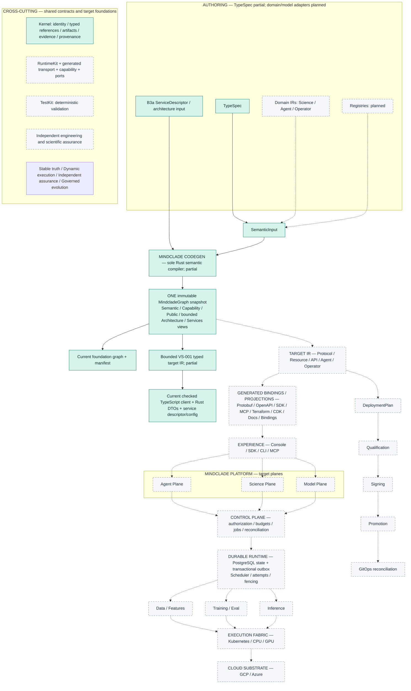

This page presents the layered platform diagram for developers, reviewers and agents orienting to the full target system. This is an illustrative target design as of 2026-09-23; the foundation is partial. [Accepted ADRs](/architecture/adr/adr-000-mindclade-vnext-architecture-constitution), [architecture metadata](https://github.com/Mindclade-org/mindclade-internal-monorepo/blob/main/docs/architecture/model/architecture.yaml) and [maturity](https://github.com/Mindclade-org/mindclade-internal-monorepo/blob/main/docs/architecture/maturity.yaml) govern the interpretation. This is not an emitted architecture atlas or a live service topology. The [coverage map](/architecture/foundations/blueprint-coverage) resolves every layer to paths and detailed references.


<Info>
  [Asset provenance](https://github.com/Mindclade-org/mindclade-internal-monorepo/blob/main/docs/architecture/assets/README.md) records the corrected image and its limits. There are no completion percentages. Dashed center boxes are planned. Solid compiler boxes describe a partial implemented path, not full frontend/product coverage. The kernel and RuntimeKit (B3b Stages A/B) are partial; TestKit and independent platform assurance remain planned. Logical planes do not mandate separate microservices.
</Info>

The default API source is TypeSpec; Protobuf is a generated projection. A future optional Protobuf-first contract requires distinct, explicitly reviewed ownership, not a second authored definition of a TypeSpec-owned API. The [generated-surface ledger](/architecture/generated-surface-ownership) defines every boundary.

## Canonical flow

The editable [Mermaid source](https://github.com/Mindclade-org/mindclade-internal-monorepo/blob/main/docs/architecture/assets/system-overview.mmd) makes the target relationships inspectable and shows bounded B2a consumers plus B3a service compilation. The raster is a dated target reference; its original current-state footer predates B2a and must not be used as today's implementation inventory. Arrows describe conceptual derivation or governed work dispatch, not import permission or a deployed connection. The [master blueprint](https://github.com/Mindclade-org/mindclade-internal-monorepo/blob/main/docs/architecture/MASTER_BLUEPRINT.md#iv-domain-ownership-and-dependency-direction) owns dependency direction. Inference does not import training loops merely because both workloads share the execution fabric.



## Text equivalent

```text
TypeSpec / domain IRs + descriptors / architecture models / registries
  -> SemanticInput -> sole Rust Codegen compiler
  -> ONE immutable MindcladeGraph, with Semantic, Capability, Public,
     bounded Architecture and Services views
  -> target IR (Protocol / Resource / API / Agent / Operator; broader views planned)
  -> generated Protobuf / OpenAPI / SDK / MCP / Terraform / CDK / docs / bindings
  -> experience (console / SDK / CLI / MCP)
  -> Agent / Science / Model logical planes
  -> control plane (authorization / budgets / jobs / reconciliation)
  -> durable platform runtime (PostgreSQL state + transactional outbox;
      scheduler / attempts / fencing)
  -> data/features, training/evaluation and inference workloads
  -> execution fabric (Kubernetes / CPU / GPU)
  -> cloud substrate (GCP / Azure)

Cross-cutting: shared kernel + thin RuntimeKit service composition + TestKit
              + independent assurance + architecture laws.
Delivery: DeploymentPlan -> qualification -> signing -> promotion -> GitOps.
Current implemented subpath: TypeSpec -> partial Codegen/kernel -> graph/manifest
                            -> bounded VS-001 TypeScript client and Rust DTOs
                            -> checked B3a descriptor and service configuration.
Other platform layers and broader generated products remain planned.
```

<Warning>
  The shared responsibilities (stable truth, dynamic execution, independent assurance and governed evolution) apply across these layers. They do not replace them. The kernel defines shared identities and evidence; services compose domain capabilities through ports. Neither a diagram arrow nor a successful Run grants capabilities or qualifies a scientific claim. Forge is a historical name resolved to `codegen/`, never a second compiler root.
</Warning>

## Detailed views

- [System context](/architecture/foundations/system-context): actors, boundaries and root/plane ownership.
- [Semantic compilation](/architecture/foundations/semantic-compilation): compiler, graph and product lifecycle.
- [Platform execution](/architecture/foundations/platform-and-execution): services, kits, durable state and failures.
- [Scientific and agent planes](/architecture/foundations/scientific-and-agent-planes): biological/data/model flows.
- [Security and assurance](/architecture/foundations/security-and-assurance): trust boundaries and scoped claims.
- [Delivery and operations](/architecture/foundations/delivery-and-operations): fabric, cloud, recovery and evidence.
- [Supervised engineering](/architecture/engineering/supervised-system-blueprint): work authority and protected lifecycle.

Read next: the [foundations overview](/architecture/foundations/overview), or the [system design](/architecture/system-design) for one continuous explanation.

## Related

<CardGroup cols={2}>
  <Card title="Foundations Overview" icon="layer-group" href="/architecture/foundations/overview">
    Core architectural foundations with path references.
  </Card>

  <Card title="System Design" icon="sitemap" href="/architecture/system-design">
    One continuous explanation of the target system.
  </Card>

  <Card title="Bootstrap Status" icon="list-check" href="/architecture/bootstrap-status">
    Finalized baseline and remaining blockers.
  </Card>

  <Card title="Generated Surface Ownership" icon="shield" href="/architecture/generated-surface-ownership">
    Boundaries for every generated surface.
  </Card>
</CardGroup>
