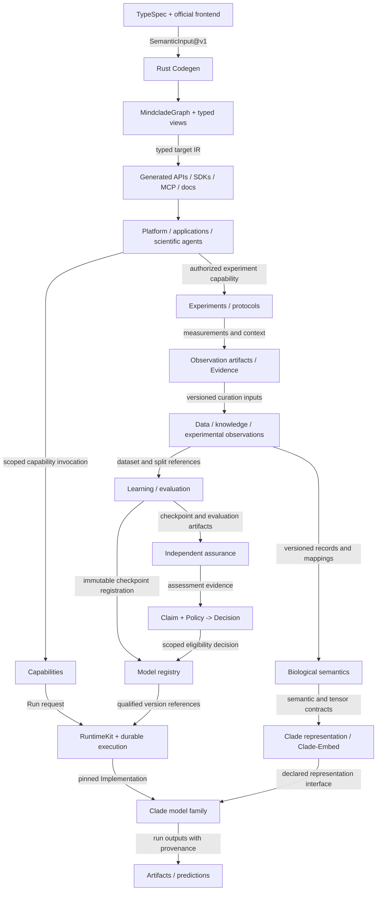

Programmable Biology is the planned scientific companion to ADR-006. It defines domains such as biological semantics, data curation, experiments, learning, and model qualification that follow the engineering foundation laid by Phase 0 and VS-001. This page reconciles the original Mindclade Programmable Biology Blueprint with the vNEXT constitution.

<Warning>
  Status: Planned domain design. Diagrams and contracts are planning aids, not evidence of implementation.
</Warning>

## Reconciliation With vNEXT

| Supplied blueprint | Adopted interpretation |
| --- | --- |
| Forge / `forge/` | Codegen / `codegen/` is the sole semantic compiler. |
| SemanticGraph | A typed view of the single `MindcladeGraph`, not another graph authority. |
| Diagram as source of truth | A conceptual explanation constrained by repository ADRs and architecture metadata. |
| Full future repository tree | Logical ownership boundaries, with the explicit manifest-controlled scaffold authorized by ADR-015. Placeholders remain planned; real activation requires a reviewed implementation transition. |
| Learning owns qualification | Learning produces evaluation evidence; independent assurance evaluates claims under policy. |
| Model registry feeds runtime | Registration records artifacts; runtime eligibility additionally requires applicable qualification decisions. Production promotion follows ADR-012. |
| Scientific development order | Phase 0 and VS-001 first, then evidence-gated scientific verticals. |

## Scientific System Map

Arrows describe proposed information or invocation contracts, not deployment boundaries. Domain modules start within the modular monolith. An implementation must give each major edge a typed input/output, owning domain, version and compatibility rules, provenance, and a conformance or scientific acceptance check.



Runtime execution follows PostgreSQL state plus transactional outbox, scheduler, worker, artifacts, evidence, assurance, and decision. RuntimeKit supplies service behavior; TestKit supplies deterministic fakes and replay checks. Every deployable eventually carries `ServiceDescriptor@v1`. Production changes follow synthesis then qualification then signing then promotion then GitOps, with reconciliation evidence; neither registry insertion nor a scientific decision alone deploys a model.

## Domain Ownership

These are logical responsibilities, not a request to scaffold new roots or deploy separate services. Compute, models, learning, and runtime retain the boundaries in [ADR-007](https://github.com/Mindclade-org/mindclade-internal-monorepo/blob/main/docs/architecture/adr/ADR-007-compute-models-learning-and-runtime-boundaries.md).

| Domain | Owns | Boundary |
| --- | --- | --- |
| Architecture and contracts | Frontend contracts, semantic lowering, graph views, generated surfaces | Official TypeSpec semantics are consumed once by the frontend; downstream emitters consume Codegen output. |
| Biological semantics | Canonical entities, BiologicalState, interventions, conditions, observations, measurements | Meaning is independent of PyTorch, HTTP, Kubernetes, and transport DTOs. |
| Biological data | Ingestion, curation, dataset snapshots, splits, lineage, access constraints | Map source records to versioned biological identities; preserve source and transformation provenance. |
| Scientific knowledge | Literature, ontologies, scientific assertions, supporting and conflicting evidence | Retrieved assertions remain scoped claims; evidence does not silently redefine biological meaning. |
| Experiments | Design, versioned protocols, execution records, measurements, observations | Distinguish measured, simulated, and inferred results, including controls and conditions. |
| Compute | Tensor contracts, operators, kernels, execution topology, numerical parity | TileLang behind operator contracts; generated C ABI for native bindings; no Triton or `tch-rs` baseline dependencies. |
| Models | Clade representation, molecular, cellular, systems, and multiscale mathematical definitions | Consume explicit biological and tensor contracts; publish applicability limits. |
| Learning | Objectives, training, posttraining, optimization, checkpointing, evaluation | Produce traceable artifacts and evidence; independent assurance owns qualification. |
| Runtime | Qualified model execution, batching, scheduling, execution resource use | Resolve pinned artifacts and eligible implementations without changing model or biological meaning. |
| Platform and agents | Capability discovery and invocation, application adapters, user workflows | Agents invoke capabilities under attenuated authority; no direct model-internal or ambient credential access. |

Scientific knowledge graphs contain domain records and assertions. They are not additional semantic compiler graphs. Their schemas and capability interfaces are compiled through `MindcladeGraph`; their versioned data is referenced as artifacts.

## Candidate Contract Boundaries

The names below are design vocabulary, not existing TypeSpec schemas or frozen wire formats. A follow-on slice must define its schemas, compatibility rules, fixtures, and independent acceptance criteria before claiming implementation.

| Boundary | Minimum information to preserve | Acceptance concern |
| --- | --- | --- |
| Source records -> biological semantics | Source and entity references, ontology/mapping versions, units, conditions, transformation provenance | Ambiguous identities, incompatible units, and missing context are explicit. |
| BiologicalState / Intervention / Observation | Subject and scale, time or time interval, assay/measurement context, units, uncertainty, observed versus inferred status | Stable meaning across ingestion, experiments, learning, and runtime. |
| Biological semantics -> TensorBundle | Semantic field-to-tensor mapping, shape, axes, dtype, units, masks, preprocessing and operator versions | Shape and unit compatibility; missingness and lossy transformations are recorded. |
| Representation -> model | Encoder/checkpoint reference, input modality, output shape, normalization, supported scope | Compatibility is evaluated when embeddings or encoders change. |
| Molecular -> cellular -> systems | Explicit aggregation/intervention mapping, scale and time assumptions, calibration, uncertainty propagation | A cross-scale claim needs bridge-specific evidence, not merely matching tensor dimensions. |
| Capability -> runtime -> implementation | Typed input/output references, implementation and model versions, authorization scope, run identity | Deterministic fake replay first; real execution records its environment and reproducibility limits. |
| Experiments -> observations -> learning | Protocol, sample, run and measurement references, controls, dataset/split versions, selection decisions | Traceable feedback, quality checks, and separation of evaluation data from training inputs. |
| Learning -> assurance -> registry | Dataset, split, checkpoint and evaluator references, results, claim scope, policy and decision references | Independent evaluation; registration alone confers no qualification. |

## Shared Kernel in Scientific Work

Use the existing kernel instead of creating parallel scientific identity, provenance, or qualification systems.

| Kernel primitive | Scientific use |
| --- | --- |
| Identity / Reference`T` | Stable entity identities and typed immutable references to exact artifact versions. |
| Artifact | Dataset snapshots, tensor bundles, protocols, observations, embeddings, checkpoints, predictions, and evaluation bundles, bound to digests. |
| Capability / Implementation | An operation such as embed, predict, simulate, design, generate, analyze, plan, or evaluate, bound to a particular implementation. |
| Run | A training, inference, evaluation, or experiment execution with recorded inputs, outputs, and execution context. |
| Evidence | Measurements and evaluation results with method, scope, provenance, and limitations. |
| Claim | A scientific assertion about an explicit subject, population/conditions, applicability scope, and uncertainty. |
| Policy / Decision | Versioned acceptance criteria and the recorded outcome of assessing a claim against evidence. |
| Provenance | Source, transformation, dataset, model, operator, execution, and evaluator lineage. |

An observation can support or challenge a claim; it does not establish the claim by itself. A checkpoint is a training artifact; scientific qualification, release qualification, and deployment evidence are distinct. A decision for one task, dataset, or biological context does not automatically qualify another.

## Clade Development Sequence

This is a planned sequence subject to reviewed slice contracts and measured results. Clade names describe intended model roles, not existing capabilities.

1. Complete Phase 0 and [VS-001](/architecture/vs-001-semantic-development-loop). Prove the compiler, generated surfaces, durable execution, independent assurance, and replay using a deterministic fake Clade artifact.
2. Establish one protein-first biological vertical: entity identity, BiologicalState, intervention/observation vocabulary, artifact lineage, and a bounded dataset plus scientific knowledge mapping. Start with pinned, local PDB/UniProt-style fixtures and a literature fixture; source acquisition and use approval remain separate. Define experimental provenance at this stage even if automated experiment execution comes later.
3. Define TensorBundle and operator boundaries with reference implementations and numerical checks. Introduce native optimization only for a measured need.
4. Develop Clade Representation Core / Clade-Embed, beginning with protein sequence to residue representation to pooled embedding, then one bounded Clade Molecular task. Clade-Embed is a capability over shared representation machinery, not a second encoder stack. Pair the work with versioned training/evaluation data, baselines, uncertainty assessment, and independent qualification criteria from the start.
5. Serve a qualified capability through the existing runtime foundation and generated API. Search and scientific retrieval can support this vertical; the pasted `POST /v1/responses` route remains a candidate API projection until its contract and compatibility requirements are reviewed.
6. Explore Clade Cellular / Virtual Cell and Clade Systems through explicit, independently evaluated molecular-to-cellular and cellular-to-systems bridges. Compare a dense multiscale baseline before considering sparse hierarchical mixture-of-experts; complexity requires measured scientific and scaling gains.
7. Expand experiment/protocol execution and scientific agent workflows around already qualified capabilities. Each closed-loop action retains explicit authorization, provenance, evidence, and policy decisions.

## Scientific Acceptance Detail

The data blueprint, representation blueprint, evaluator workflow, and data release template add the following planned acceptance requirements:

- Biological identifiers retain coordinate/reference systems, units, conditions, and provenance. Test invalid alphabets, missing context, incompatible units, and canonical serialization across supported bindings.
- Dataset manifests bind source release/digest, transformations, schema, intended use, access/retention constraints, split manifests, and exclusions. Repeated ingestion of the same pinned fixture is idempotent and deterministic CI requires no live source network access. Public availability does not establish permitted use. A candidate source is not a selected or qualified training dataset.
- Split qualification records deduplication, cross-source overlap, temporal and biological family/cluster controls appropriate to the claim. Validate leakage checkers with deliberately contaminated fixtures and retain their reports.
- Knowledge assertions retain exact passage/citation, extraction version, entity ambiguity, scope, and supporting or contradicting evidence. Retractions and source revisions supersede assertions without deleting history. Retrieval relevance and evidentiary support require separate evaluation.
- Representation contracts carry modality, granularity, semantic axes, normalization, model revision, applicability, and artifact reference. Large outputs use artifact references. Evaluate family/cluster-held-out retrieval, contamination, stability, and measured runtime cost; a shared architecture does not force every modality into an identical latent space.
- Operator qualification uses pinned CPU references and generated C ABI boundaries with opaque tensor handles. Declare shape/dtype/device coverage, forward and gradient tolerances, checkpoint compatibility, and unsupported cases. CPU fake behavior proves neither GPU performance nor biological accuracy.
- Validate evaluators using independent positive, negative, and edge cases before a campaign. Freeze scorer, dataset/splits, thresholds, exclusions, relevant seeds/repetitions, judge versions, and acceptance-query allowance. Keep protected holdouts separate from candidate development; evaluator changes become reviewed new versions, not same-candidate threshold edits.
- Record Pass, Fail, Inconclusive, or Blocked as an assessment distinct from run execution status. Preserve failed runs, negative results, uncertainty, sample counts, baseline comparisons, protocol deviations, and independent review. Scientific, software, numerical, deployment, and publication claims each need evidence for their own scope.

Use [execution reliability](/architecture/execution-reliability) for campaign admission, atomic budgets, external job recovery, and compatible checkpoint resume. Start with computational experiments and a bounded smoke run before larger allocation. Laboratory adapters follow a stable protocol/evidence model and their own authority.

For cellular work, first freeze the falsifiable contract `CellState(t) + Intervention + Condition + delta_t -> future-state distribution`. Require held-out interventions/contexts and explicit uncertainty. A molecular-to-cellular bridge must improve matched held-out baselines; tensor compatibility alone cannot demonstrate a useful causal or biological bridge.

The model family is named Clade (Rob, 2026-09-26). It was called NOVA before then, and dated reviews, plans, criteria and the original blueprint source keep that name. The planned scaffold directory stays `models/nova/`, as the original blueprint lays it out ([ADR-015](https://github.com/Mindclade-org/mindclade-internal-monorepo/blob/main/docs/architecture/adr/ADR-015-original-blueprint-scaffold-alignment.md)), until a reviewed activation renames it. NOVA-1, Clade-1, AF3, and Protenix references in older catalogue records do not select a vNEXT release name, architecture, checkpoint, or implementation. Resolve those choices with the relevant slice contract and evidence before adoption.

## Evidence and Evolution Loop

```text
Question / objective
  -> scoped claim, hypothesis, and acceptance criteria
  -> versioned task and contract changes in the repository
  -> engineering or scientific execution
  -> immutable artifacts, evidence, and provenance
  -> independent assessment under policy
  -> decision with limitations and applicability scope
  -> reviewed next experiment, implementation task, or architecture proposal
```

Linear is the current single engineering work authority; Notion holds explanatory context and outcome links. Both remain external adapters in the architecture. Replacing a selected adapter requires a reviewed transition that preserves one live work authority; this design does not permit a second tracker backlog. Repository sources, immutable artifacts, and authoritative execution/evidence systems retain their respective authority. Do not copy mutable task status into architecture truth or treat a Notion summary as scientific evidence. Outcomes inform governed evolution under ADR-014; they do not authorize agents to rewrite the constitution.

## Related

<CardGroup cols={2}>
  <Card title="VS-001 Semantic Loop" icon="arrows-spin" href="/architecture/vs-001-semantic-development-loop">
    The engineering foundation that precedes scientific verticals.
  </Card>

  <Card title="Execution Reliability" icon="shield-check" href="/architecture/execution-reliability">
    Planned runtime requirements for durable campaign execution.
  </Card>

  <Card title="System Design" icon="diagram-project" href="/architecture/system-design">
    Single-page design explanation and layered architecture.
  </Card>

  <Card title="ADR-006" icon="file-contract" href="/architecture/adr/adr-006-biological-world-model-authority">
    The ADR that authorizes the biological world model boundary.
  </Card>
</CardGroup>
