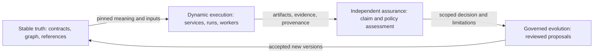
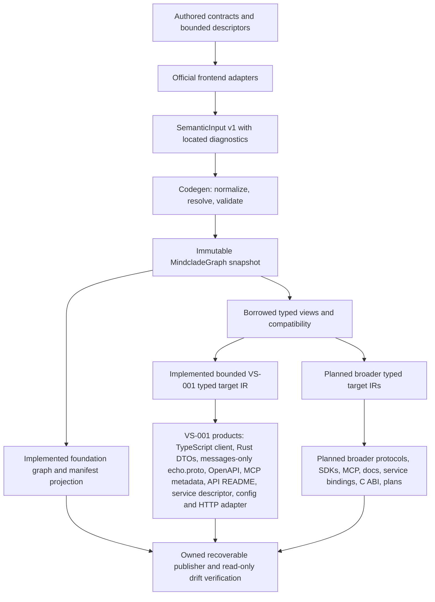
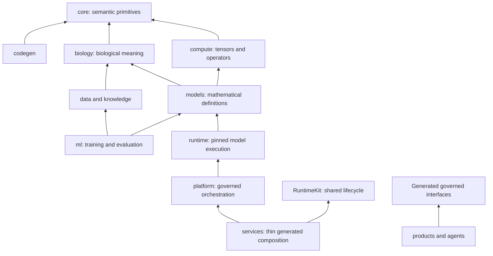
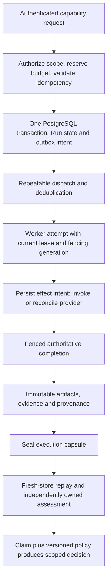
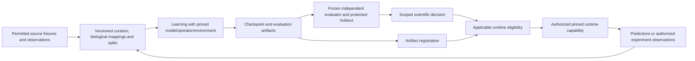

Status: explanatory design guide, 2026-09-23. The full target system is not implemented. This guide explains the existing architecture; it creates no new schema, service, activation, approval or qualification. [AGENTS.md](https://github.com/Mindclade-org/mindclade-internal-monorepo/blob/main/AGENTS.md) defines precedence: accepted ADRs and architecture metadata govern this guide and the [master blueprint](/architecture/master-blueprint). Current source/checkpoint evidence and next-task status live in the [agent handoff](/developer/agent-handoff).

[Illustrative Mindclade system overview](https://github.com/Mindclade-org/mindclade-internal-monorepo/blob/main/docs/architecture/assets/system-overview.png) (target architecture, not proof of implemented or qualified components)

The image preserves the agreed layers: semantic compilation; experience and scientific/agent/model planes; control and durable runtime; workloads, execution fabric and cloud substrate; shared laws and governed delivery. Its [editable diagram and text equivalent](/architecture/platform-diagram) and [asset provenance](/architecture/assets/overview) are retained with it. It is illustrative, not an authoritative schema, Codegen-emitted atlas or evidence of execution. No layout percentage is a completion measure.

The [foundations reading guide](/architecture/foundations/overview) expands each layer into ownership, interfaces, lifecycles, failure cases and evidence requirements. Use its [20-section coverage map](/architecture/foundations/blueprint-coverage) to trace the original blueprint; use this page for an end-to-end overview.

## Contents and Coverage

| Master blueprint area | Explanation here | Detailed authority |
| --- | --- | --- |
| I. Authority and scope | This entry, coverage and maturity | [Constitution](/architecture/adr/adr-000-mindclade-vnext-architecture-constitution), [architecture YAML](https://github.com/Mindclade-org/mindclade-internal-monorepo/blob/main/docs/architecture/model/architecture.yaml) |
| II. Four responsibilities | Responsibilities, kernel/evidence, evolution | [Stable truth](/architecture/adr/adr-001-stable-truth-dynamic-execution), [assurance](/architecture/adr/adr-009-independent-assurance) |
| III. Semantic compilation and kernel | Kernel and compiler | [Compiler](/architecture/adr/adr-002-codegen-is-the-sole-semantic-compiler), [graph](/architecture/adr/adr-003-mindcladegraph-and-typed-graph-views) |
| IV. Domain ownership and dependency direction | Domain boundaries | [Model boundaries](/architecture/adr/adr-007-compute-models-learning-and-runtime-boundaries), [layout](https://github.com/Mindclade-org/mindclade-internal-monorepo/blob/main/docs/architecture/model/repository-layout.json) |
| V. Durable execution and composition | Services and recovery | [RuntimeKit/TestKit](/architecture/adr/adr-008-runtimekit-and-testkit), [execution reliability](/architecture/execution-reliability) |
| VI. Scientific blueprint | Scientific lifecycle | [Biological authority](/architecture/adr/adr-006-biological-world-model-authority), [programmable biology](/architecture/programmable-biology) |
| VII. Security, products and deployment | Compiler products, trust and delivery | [Agent capabilities](/architecture/adr/adr-011-agent-capability-attenuation), [deployment](/architecture/adr/adr-012-synthesis-qualification-signing-promotion-gitops) |
| VIII. Build, delivery and change control | Builds and evolution | [Toolchain](/architecture/toolchain), [roadmap](/architecture/implementation-roadmap), [engineering evolution](/architecture/adr/adr-014-engineering-factory-and-governed-evolution) |

The [original 20-section alignment record](/architecture/reviews/2026-09-22-original-blueprint-alignment) preserves exact historical coverage. Sections 1/4/20 map to responsibilities/laws; 2/3/5 to the full tree and domain boundaries; 6/13 to compiler/products and metadata; 7/8/9 to service composition; 10/18 to delivery/adapters; 11/12 to engineering and scientific provenance; 14/15 to VS-001 and development; 16 to scientific planes; 17 to trust/security; 19 to maturity. Its dated "CI absent" and pin observations are historical, not present status. The [full repository tree](/architecture/repository-tree) mechanically lists all tracked inventory and planned responsibilities; a directory or `.gitkeep` is not a working component. The [scaffold manifest](https://github.com/Mindclade-org/mindclade-internal-monorepo/blob/main/docs/architecture/model/blueprint-scaffold.json) and [ADR-015](/architecture/adr/adr-015-original-blueprint-scaffold-alignment) constrain placeholders.

## Responsibilities and Maturity

Mindclade separates four responsibilities so execution cannot silently change its meaning or decide its own acceptance. Stable truth owns versioned contracts, immutable graph snapshots and attributable artifacts/evidence. Dynamic execution performs authorized runs and effects against those versions. Independent assurance assesses explicit claims under frozen criteria and policy. Governed evolution uses those outcomes to propose reviewed changes, rather than editing history or relaxing criteria within the candidate that failed them.



Arrows are the target information/control cycle, not implemented services or permission grants. Immutable evidence can record a wrong assertion; immutability establishes identity and attribution, not scientific truth.

| Surface | Current boundary |
| --- | --- |
| Kernel, official TypeSpec frontend, compiler, graph and foundation projection | Partial source implementation; real bounded compilation exists |
| A1 publication, A2 compatibility, A3 evidence export/readback | Bounded source milestones; broader acceptance and retention remain incomplete |
| B1 declarations/public view | Partial; bounded B1a exact-value rules and B2a checked reference bridges/consumers implemented; broader views remain open. Rob accepted the contract-owner baseline on 2026-09-26 (non-passing items stay listed, not waived) |
| DX1 entry/preflight and G1 observation binding | Reviewed source milestones; G1 trust/adoption and live binding remain BLOCKED |
| Generated VS-001 consumers | Bounded B2a TypeScript client and Rust DTO source checkpoint, with real consumer checks |
| Descriptors and architecture views | B3a compiler source integrated at main `06a903f` (PR #11) with exact-commit local and Linux checks |
| RuntimeKit/TestKit and actual dependency enforcement | B3b Stages A/B integrated at `0d44a36` (checked configuration ABI; bounded std::net HTTP/1.1 transport with finite shutdown); Stages C/D (Codegen HTTP adapter, test-only TestKit, non-durable Echo composition and binary) integrated at `72b762d` (PR #18) as non-durable partial VS-001; B4 enforcement integrated at `b7f69c0` (PR #22) | `just verify-boundaries` checks the running host's actual Cargo, Bazel and TypeScript facts against the architecture model in every `just verify`, and the two-host matrix passed once for B4's head |
| PostgreSQL/outbox, replay, independent runtime assessment | Planned C/D tasks |
| Biology/data/model/learning/scientific agents, optimized operators, production infrastructure | Planned, scaffolded where recorded; no scientific/deployment qualification |
| Protected engineering operation and trusted custody | O2 transfer done 2026-09-26; dedicated App, main protection and merge queue observed live ([governance status](/architecture/engineering/governance-status)). O3 evaluator/custody adoption, the archive and O4 acceptance remain BLOCKED |

[Maturity YAML](https://github.com/Mindclade-org/mindclade-internal-monorepo/blob/main/docs/architecture/maturity.yaml) owns the vocabulary and recorded boundaries. "Implemented" applies only to the stated behavior with focused tests; "qualified" needs independent evidence under policy; "production" additionally needs signed release and deployment evidence. No whole-platform claim reaches those levels.

## Kernel and Evidence Laws

The shared kernel prevents each domain inventing incompatible identity or evidence rules. A logical Identity names an entity; a revision selects a version; a Digest identifies bytes. `Reference<T>` also constrains target kind. Artifact, Capability, Implementation, Run, Evidence, Claim, Policy, Decision and Provenance use that foundation. A model checkpoint, dataset, deployment plan or protocol therefore carries the same exact-reference discipline as a compiler artifact.

A capability declares what can be done; an implementation identifies how a pinned version does it; a run records one execution. Outputs become immutable artifacts with provenance. Evidence has method, scope and limitations. A claim plus relevant evidence and a versioned policy produces a scoped decision; recording an artifact or completing a run does not itself authorize another action.

[Identity/reference law](/architecture/adr/adr-004-identity-reference-and-artifact-law) and [evidence/decision law](/architecture/adr/adr-005-evidence-claim-policy-and-decision-law) govern this model. Actual [kernel exports](https://github.com/Mindclade-org/mindclade-internal-monorepo/blob/main/core/src/lib.rs), [identity validation](https://github.com/Mindclade-org/mindclade-internal-monorepo/blob/main/core/src/identity.rs) and [typed references](https://github.com/Mindclade-org/mindclade-internal-monorepo/blob/main/core/src/reference.rs) implement bounded primitives. The presence of [Run](https://github.com/Mindclade-org/mindclade-internal-monorepo/blob/main/core/src/run.rs) or evidence records does not supply a durable execution engine, scientific evaluator or external trust custody.

## Compiler and Generated Products

Authored contracts enter official language frontends; TypeSpec resolves its own language semantics once. The adapter produces versioned `SemanticInput@v1` with source locations. Rust Codegen normalizes, resolves and validates platform meaning, then seals one immutable `MindcladeGraph@v1`. Typed views borrow this snapshot; they are not independently editable graphs. Compatibility uses graph meaning, and target IR/emission must consume that validated meaning without rediscovering it.



This is the target compiler flow with the implemented foundation and bounded VS-001 subpaths explicitly marked. Current [compiler exports](https://github.com/Mindclade-org/mindclade-internal-monorepo/blob/main/codegen/src/lib.rs), [pipeline](https://github.com/Mindclade-org/mindclade-internal-monorepo/blob/main/codegen/src/pipeline.rs), [graph](https://github.com/Mindclade-org/mindclade-internal-monorepo/blob/main/codegen/src/graph.rs), [official frontend](https://github.com/Mindclade-org/mindclade-internal-monorepo/blob/main/codegen/frontend/typespec/src/index.mjs), [projection](https://github.com/Mindclade-org/mindclade-internal-monorepo/blob/main/codegen/src/projection.rs), [compatibility](https://github.com/Mindclade-org/mindclade-internal-monorepo/blob/main/codegen/src/compatibility.rs) and [publisher](https://github.com/Mindclade-org/mindclade-internal-monorepo/blob/main/codegen/src/publication.rs) are actual source. Broader frontend, IR and output boxes marked planned describe extension, not callable modules. Current Semantic/Capability views and declarations now have bounded B3a architecture and service views alongside them, with local aggregate verification. Broader deployment, assurance and provenance views remain planned. Domain knowledge graphs hold versioned data under compiled schemas; they never become another compiler.

Public/internal audience is transitive: a public product cannot expose internal types through fields, imports or dependent declarations. Authored public/internal TypeSpec and visibility validation exist. B1a defines the exact timestamp, Unicode, artifact JSON and revision/generation rules. B2a emits checked Rust DTOs, reference bridges and a public TypeScript client, exercised by independent consumer fixtures. Its [product checkpoint](/architecture/reviews/2026-09-23-vs001-products) distinguishes these source results from the pending real service and durable vertical.

Generated outputs are owned projections. Authored SDK ergonomics belong under `products/sdk/`; emitted bindings belong under declared generated destinations. `protocols/` contains published projections, not alternate authored semantics. Codegen binds source inputs/fingerprints and emits deterministic graph/manifest bytes. Wall-clock envelope data cannot silently alter semantic identity. Publication must validate a complete owned inventory, retain recovery state and detect drift; manual edits or "repairing" a stub hash cannot establish conformance.

Product qualification needs actual compiled consumers, negative leakage/compatibility cases and cross-product expectations independently authored from the emitter. B2b emits structural OpenAPI, messages-only Proto, MCP tool metadata and API docs for VS-001 under `generated/vs001/public/`; broader protocol products and the native C ABI remain planned. See [projection law](/architecture/adr/adr-013-generated-projection-law), [output policy](/architecture/generated-output-policy), [developer products](/architecture/developer-products) and the [compiler completion plan](/superpowers/plans/2026-09-23-foundation-compiler-completion).

## Domain Boundaries and Dependencies

Repository roots name responsibilities, not separately deployed services. The architecture YAML is active metadata; reserved JSON model/view files are planned projections. Actual dependency enforcement over Cargo/Bazel/TypeScript facts is B4 (integrated through PR #22); file inventory alone cannot validate imports, configured features or audience.



Arrows in this diagram mean selected allowed dependency directions, not data flow, permission to access another module's database, a complete import graph or observed B4 results. Most boxes remain planned; the kernel/compiler are partial.

Biology owns canonical entities, conditions, measurements and interventions, independent of ML/HTTP vendors. Data owns acquisition/curation/snapshots/splits; knowledge owns attributable assertions and literature links. Compute owns tensor, operator, kernel and topology contracts, without importing model/training/service internals. Models define mathematics using biological/tensor contracts; learning owns optimization and training, while runtime executes pinned eligible model artifacts without depending on training loops. Platform coordinates authorized capabilities through ports. Services add generated transport and composition, not duplicate domain frameworks. Tests/qualification can share schemas and helpers without allowing production code to depend on TestKit or self-qualify.

[Blueprint IV](/architecture/master-blueprint#iv-domain-ownership-and-dependency-direction), [ADR-007](/architecture/adr/adr-007-compute-models-learning-and-runtime-boundaries) and [layout ownership](https://github.com/Mindclade-org/mindclade-internal-monorepo/blob/main/docs/architecture/model/repository-layout.json) define the boundaries. B3a implements one strict YAML/ownership adapter; B4 extends that model with real configured facts, complete coverage and negative enforcement, not a second architecture parser.

## Services, RuntimeKit and TestKit

Target services compose RuntimeKit, generated protocol adapters, a capability implementation and explicit domain ports. RuntimeKit owns lifecycle/configuration, identity, middleware, telemetry, health/readiness and shutdown. TestKit supplies deterministic clocks, identity, stores, events, workers and fake models for controlled interleavings and failures. Domain business logic stays outside both kits.

[ServiceDescriptor@v1](/architecture/service-descriptor-v1) describes identity, ownership, capabilities, protocols, dependencies, configuration, secrets, health, resources, scaling, topology, telemetry, security, deployment and qualification: 15 conceptual sections. B3a's reviewed wire form adds an `apiVersion` discriminator; it is not an extra lifecycle section. Secrets are references, never embedded values. Codegen validates ownership, paths, capabilities, fields and dependency policy and derives runtime configuration. RuntimeKit consumes generated checked configuration; it must not import Codegen or parse the authored YAML at runtime.

The authored `services/foundation_echo/service.descriptor.yaml` now compiles against the explicit architecture model and public operation inventory. The graph retains immutable checked bindings exposed through borrowed architecture/service views. Codegen emits `service/descriptor.json` for inspection and `service/config.rs` for checked construction; neither implements RuntimeKit. Other named service/worker descriptors remain incomplete planned stubs. The first Echo service is bounded loopback/local-test composition with explicitly non-durable TestAdmission. Integrated at `72b762d` (PR #18), it is source: the generated `service/http.rs` adapter composed over RuntimeKit as a library and binary, with composition and process tests for actual generated-client calls, trusted identity, body/concurrency/deadline limits, readiness and finite shutdown. A library test or an abandoned live handler is not evidence of a stopped service. The real PostgreSQL profile comes later; changing a descriptor flag cannot turn TestAdmission into durable execution. Read [ADR-008](/architecture/adr/adr-008-runtimekit-and-testkit), [ADR-010](/architecture/adr/adr-010-modular-monolith-first-deployment) and [B3a/B3b](/superpowers/plans/2026-09-23-foundation-compiler-completion).

## Execution, State and Recovery

The following lifecycle is target design, not an observed running VS-001 system. PostgreSQL state plus a transactional outbox is the durable baseline; no broker, Temporal installation or service split is selected by this diagram.



A work item, packet revision, logical Run, attempt, provider job and external effect are distinct identities. Idempotency binds canonical payload and caller scope; repeating a key with changed content must not silently become another valid run. Run admission and outbox intent commit together so a crash cannot lose admitted work or dispatch uncommitted work. Repeated deliveries require inbox/deduplication. Database-time leases and monotonically checked fencing generations ensure stale workers cannot complete authoritative state or publish outputs after ownership moves.

Effect intent is durable before calling a provider. A timeout is an uncertain outcome, not proof no effect happened; reconcile provider/job identity before retry. Retries/child runs consume the original campaign budget. Cancellation remains pending until owned execution and effects are confirmed; socket disconnection alone is not Run cancellation. Reporting failures reuse retained results rather than replaying a completed effect. Checkpoint resume requires compatible pinned inputs and records its provenance instead of treating a new process as continuity automatically.

Artifacts and provenance bind exact contracts, inputs, implementation, environment, outputs and evaluator identities. D1–D4 must build an acyclic sealed capsule, replay it in a fresh isolated store, reject missing/tampered/incompatible inputs, and bind independent assessment plus policy decision to the exact candidate. A test key cannot confer acceptance; successful source replay cannot prove scientific truth. [Execution reliability](/architecture/execution-reliability), [VS-001 design](/superpowers/specs/2026-09-23-vs001-durable-capability-design), [C plan](/superpowers/plans/2026-09-23-vs001-c-durability) and [D plan](/superpowers/plans/2026-09-23-vs001-d-assurance) define detailed failure cases. All C/D implementation and independent acceptance remain pending.

## Scientific Data, Models and Campaigns

The scientific plane remains planned. It begins after foundation work with one protein-first vertical using bounded pinned local fixtures, not unrestricted data acquisition or a production model. Acquisition permission, licences, intended use, raw/quarantine boundaries, transformations, lineage and exclusions precede adoption. Dataset snapshots retain split manifests, deduplication and temporal/family/cluster leakage controls appropriate to the scientific claim.

BiologicalState, Intervention, Condition and Observation preserve units, coordinate systems, time, context, uncertainty and measured/simulated/inferred distinctions. TensorBundle mappings add semantic axes, shape, dtype, masks and preprocessing/ operator versions. Knowledge assertions retain exact source passage, extraction version, entity ambiguity, contradictory evidence and retraction history. Retrieval relevance is separate from evidentiary support.



This target information flow grants no automatic experiment authority. Registration records a checkpoint; eligibility requires the applicable decision, and deployment still needs its own release/promotion path. Feedback is versioned curation input, not permission to train on protected evaluation data.

Clade Representation supplies shared representation machinery; Clade-Embed is a capability over it. Molecular, cellular, systems, causal and multiscale roles remain future model responsibilities. A cross-scale bridge needs explicit mappings, assumptions, uncertainty propagation and held-out benefit; matching tensor shapes is insufficient. Dense matched baselines precede mixture-of-experts complexity.

Learning records dataset/split/checkpoint/operator/environment identities and produces evidence. Independently validated evaluators and criteria are frozen before campaigns; preserve seeds/repetitions, exclusions, failures, negative results, uncertainty and baseline comparisons. Scientific Pass, Fail, Inconclusive and Blocked are assessment outcomes distinct from execution success and from the engineering GovernanceReport PASS/FAIL/BLOCKED vocabulary.

Operators start with CPU references and declared shape/dtype/device coverage plus forward/gradient tolerances. Native registration goes through generated C ABI; TileLang is the future optimized-kernel path when justified by measurement. Neither Triton nor tch-rs belongs to the baseline. Fake CPU artifacts cannot establish GPU speed or biological accuracy. [Programmable biology](/architecture/programmable-biology), [ADR-006](/architecture/adr/adr-006-biological-world-model-authority) and [provenance requirements](/architecture/provenance-requirements) retain detailed scientific contracts, acceptance and experimental lineage requirements.

## Trust, Security and Agents

Identity/tenant/audience checks apply at admission and effect boundaries. Private source, previews, raw specs, search results and evidence must retain the approved audience. Raw/quarantined data, licensing, model/generated artifacts, environment, approval, secrets, external APIs and production are explicit trust boundaries. Retrieved text is untrusted input; it cannot redefine contracts or expand tools.

Agents consume governed generated interfaces with explicit owned paths, actions, network/tool ceilings, credentials, budgets and stop conditions. Children inherit no authority automatically. Operators retain privileged setup and signing keys; worker credentials must not provide ambient administration or direct database bypass. A WorkPacket is a non-semantic engineering record, not a capability or lock. Rob plus fresh agent review provides supervised engineering acceptance only, not organizationally independent scientific or release assurance.

The implemented governance tools produce bounded observations and local integrity reports. G1 separates transport joins from trusted execution binding. Its accepted workflow/producer identity, executed invocation proof, independently retained bytes and prior PR custody remain external O3 prerequisites; source fixture PASS cannot supply them. Artifact redirects are BLOCKED until the owner confirms the host. G2 queue observation/binding source is integrated at `22a07e4`; its live proof is BLOCKED until O3, although the merge queue itself is live. G3 admission code that consumes an independently regenerated B4 matrix report is integrated at `2937bf1` (PR #24), but the accepted policy stays `pending`, so code admission is BLOCKED until O3 adopts the [G3 proposal](/superpowers/specs/2026-09-26-g3-accepted-policy-proposal). The [governance guide](/developer/governance-tools), [policy](https://github.com/Mindclade-org/mindclade-internal-monorepo/blob/main/.agents/policies/supervised.md), [ADR-009](/architecture/adr/adr-009-independent-assurance) and [ADR-011](/architecture/adr/adr-011-agent-capability-attenuation) define these limits.

## Delivery, Infrastructure and Observability

Deployment follows reviewed intent and synthesis, not direct production mutation from an SDK or infrastructure file. CDK/Terraform/GitOps material are projections or adapters; the semantic contracts and policy remain repository-owned.


This is entirely a target delivery flow. Release sets bind exact independently versioned component digests. Partial publication is reconciled without replacing immutable versions or prematurely moving discovery pointers. Release, runtime eligibility, scientific assessment and deployment decisions retain separate scopes. Kubernetes, GCP/Azure and OpenTelemetry remain design targets; no deployment is performed or qualified by this foundation. Retool, Vercel, Notion, trackers and external model providers are adapters, not semantic authorities.

RuntimeKit is intended to provide telemetry, health/readiness and shutdown hooks; service descriptors carry observability configuration and secret references. Correlate observations with logical run, attempt, provider/effect, artifact and candidate identities so operators can distinguish failure, missing evidence and uncertain completion. Protect bodies, credentials and DSNs from logs. Current foundation receipts and doctor diagnostics are implemented source observations, not a live distributed monitoring stack or measured service-level objective. See [ADR-012](/architecture/adr/adr-012-synthesis-qualification-signing-promotion-gitops), [provenance](/architecture/provenance-requirements), [descriptor](/architecture/service-descriptor-v1) and [retention](/architecture/evidence-retention).

## Builds, Development and Governed Evolution

Nix supplies committed toolchain inputs; Bazel owns executable foundation build/test actions. Cargo/TypeSpec/frontend inputs remain pinned and inventoried. Provisioning may need approved network/cache access before offline actions; a fresh clone is not automatically an offline build. Apple Silicon macOS and x86_64 Linux are the supported execution baselines. Intel macOS has no development shell (removed from the flake in H1-19); other hosts need their own reviewed evidence. Do not replace missing tools with host packages or silently rewrite locks. [Start here](/developer/start-here) records the Nix 2.35.1 prerequisite and actual commands; [toolchain](/architecture/toolchain) records pins.

Authorized integrator examples, when the parent owns execution:

```bash Terminal
nix develop --no-write-lock-file -c just doctor
nix develop --no-write-lock-file -c just verify
nix develop --no-write-lock-file -c cargo run --locked -q -p mindclade-codegen -- --help
```

[justfile](https://github.com/Mindclade-org/mindclade-internal-monorepo/blob/main/justfile) defines the aggregate, focused checks, explicit `generate-foundation`, `generate-vs001`, `update-tree` and `fmt-check`, and the conveniences `check`, `test`, `fmt`, `run-echo` and `git-setup`; a bare `just` lists them. Doctor is read-only diagnosis; it neither provisions tools nor grants readiness. The CLI help may build the binary. The read-only generated check does not repair drift. The tree enumerator is not a semantic compiler. Source exposes only the B4 commands that exist (`codegen
check-architecture`, `check-boundaries` and `just verify-boundaries`), not what plans describe.

Linear owns work; Git owns reviewed technical authority; Notion holds context and outcome links. [Supervised development](/developer/supervised-development) and the [provider-neutral workflow](https://github.com/Mindclade-org/mindclade-internal-monorepo/blob/main/.agents/workflows/foundation-development.md) require fresh criteria before bounded implementation, distinct task review, parent-owned execution and fresh whole-candidate review. No installed plugin, provider-specific memory or hidden session file is required. Governing inputs and receipts bind exact packet/specification/policy/source/base/candidate/evaluator identities; changes invalidate dependent evidence. One integrator owns the sole dispatch route and reconciles attempts before repeated delivery can start work.

The protected route is PR/CODEOWNER review, exact merge-group checks, human queue admission, resulting-main verification, approved private immutable evidence and verified download before Linear closure. Operational custody still depends on operator controls and retention; expiring CI artifacts/local copies do not establish independent durable custody. Rob's manual Enterprise migration must be followed by identity/private-audience/access/App/protection/trust revalidation. See the [operator aftermath checklist](/operations/github-governance#manual-enterprise-migration-aftermath). This source closeout grants no standing bypass, policy adoption or automatic transfer.

Governed evolution links intent, specification, source, builds, tests, artifacts, assessment, decisions and incidents/remediation. Architecture-law changes require ADR review; new source surfaces need ownership, contracts/tests/builds, real boundary checks and honest maturity. Scaffold presence or documentation completion cannot activate them. [ADR-014](/architecture/adr/adr-014-engineering-factory-and-governed-evolution), [engineering blueprint](/architecture/engineering/supervised-system-blueprint) and [requirements traceability](/architecture/engineering/requirements-traceability) explain the wider engineering graph; it remains broader than implemented governance helpers.

## Priorities and Implementation Limits

The [canonical task register](/developer/agent-handoff#current-task-register) and [master order](/superpowers/plans/2026-09-23-v1-integration-readiness) record the user-requested source sequence B1a/B2a/B3a/B2b/B3b/B4/C1–C5/D1–D2. G2/G3/DX2, independent D3/D4 acceptance and O1–O4 retain separate gates. Practical recommendations within that order are:

1. Finish correctness/trust and exact generated conformance before adding feature breadth. Preserve unsupported compatibility results and current ownership; candidate-edited expected results must not turn a failing gate into a pass.
2. Enforce real resolved dependencies, configurations and audience closure; inventory and hand-maintained import lists cannot substitute for B4 observations.
3. Prove bounded lifecycle, identity, deadlines and shutdown before durability; then test database races, fencing, uncertain effects and recovery with real stores.
4. Establish workload-specific latency/throughput/memory/cache/recovery budgets and record measurements before distributed services, GPU optimization or model scale. No performance improvement or production SLO is claimed in this guide.
5. Keep one current status register, revision-bound evidence and explicit retention/ operator owners. Refresh remote CI after integration and preserve failed or superseded receipts instead of laundering them into current success.

The entry links, common status register, Claude/provider-neutral prompts and this traceable design guide are documentation usability improvements applied in this closeout. The recommendations above remain unimplemented work. The platform is still an experimental, partial compiler foundation with planned runtime/science and blocked connected acceptance; finishing its handoff does not change that fact.
