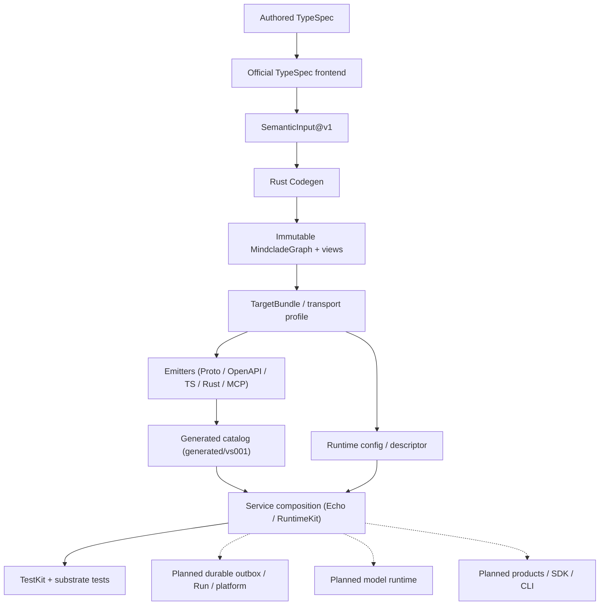

Purpose: establish what already works, then sequence the remaining repository work into reviewable vertical deliveries. Audience: Rob, the integration owner, component owners and assigned implementers/reviewers. Status: planned.

> **For agentic workers:** follow the [foundation workflow](../../../.agents/workflows/foundation-development.md), [supervised roles](../../../.agents/roles/supervised.md) and existing sole dispatch route. An available Superpowers execution skill may support that route; no plugin is required. The parent owns commands, jobs, receipts, Git and remote operations. This plan grants no implementation admission or operational authority.

**Goal:** build outward from the actual executable foundation to durable capabilities, independently assessed evidence, usable developer products, protein-first science and governed deployment without rebuilding existing work or treating scaffolds as features.

**Architecture:** retain one Rust Codegen, one immutable MindcladeGraph with borrowed typed views, contract-derived projections and thin modular-monolith service composition. Stable Truth, Dynamic Execution, Independent Assurance and Governed Evolution remain separate responsibilities. Expand one evidence-backed vertical at a time.

**Tech stack:** the committed Nix/Bazel/Rust/TypeSpec/Node toolchain and lockfiles; current bounded RuntimeKit/TestKit and generated TypeScript/Rust products; approved PostgreSQL 18.6 and `postgres =0.19.14` substrate. Future dependencies require the relevant accepted decision and exact lock review.

**Spec:** [AGENTS](../../../AGENTS.md), [master blueprint I–VIII](../../architecture/MASTER_BLUEPRINT.md), [accepted ADRs](../../architecture/adr/ADR-000-mindclade-vnext-architecture-constitution.md), [repository layout](../../architecture/model/repository-layout.json), [maturity](../../architecture/maturity.yaml) and [gate criteria](../specs/README.md). Rob directed this plan to follow the repository's accepted design; the supplied older contract-platform roadmap is a comparison checklist only.

## Milestone 0: establish what is already built

M0 is the first exit gate. Its inventory precedes final downstream scope, staffing or implementation dispatch. The initial findings below make the workplan useful now; they do not declare M0 accepted. A distinct reviewer and the parent must reconcile the exact current candidate, applicable receipts and remaining gaps.

### M0 inputs and dated baseline

The initial authoring base is `7f23af35f78ae58b41758056c2b630b0fa391d8e`, with parent-verified tree `ee08935b4c11ab5761138bd879ffab940c57ec7e`. Its tree equals PR #46 head `c5c7ae5a108e8d3a3de225d95b610970d2c355a9` and the reviewed e9 substrate source. The author inspected source in the preparation checkout and then this tree-equal planning checkout; the parent owns Git, remote and execution verification.

The parent verified the canonical private repository as `Mindclade-org/mindclade-internal-monorepo`. The previous verified main was `8ee8f0d317de9a648931128474f2f1306a9b9af1`; Rob approved PR #46 and admitted it to the queue at 08:29:21 UTC on 2026-09-28. The parent subsequently verified merge-group run `36397681066` PASS and PR #46 merged at 08:51:51 UTC as exact `7f23af35f78ae58b41758056c2b630b0fa391d8e`. Resulting-main run `36399916440` passed with retained artifacts verified. At 09:15:18 UTC, the parent verified clean primary/finalize worktrees, `origin/main` and live GitHub main at that exact commit; all other worktree heads, branches and status were preserved. This is the dated source baseline for the plan, not a claim that this documentation candidate itself is already merged.

Local audit material is retained under `/Users/robpearc/Documents/Codex/2026-09-28/ci-and-c1-preparation/`, called **R** below. R is an operator-local evidence location, not a shared immutable archive or independent acceptance record. The existing [handoff register](../../developer/agent-handoff.md#current-task-register) and Linear retain work status; this plan does not become another live backlog.

| Initial evidence | Exact scope / binding | Supported observation and remaining limit |
| --- | --- | --- |
| `R/repo-plan-m0-mechanical-inventory.json` | Base `7f23af3`, tree above; tracked-source enumeration | 1,371 tracked files, all 24 modeled roots and root-file group accounted for; counts are not completion measures |
| `R/repo-plan-m0-scaffold-disposition.json` and `repo-plan-m0-stub-seals.json` | Same base; 698 declared sealed stub paths, none missing; 698/698 seals match | Every file in each of the 12 scaffolded roots is manifest-listed scaffold. This establishes physical disposition, not qualification |
| PR #44 existing-source finalization | Parent reports merge `0262b225` and passing required checks | Credit integrated existing-source work; do not reschedule W6/DX2 verifier implementation from dated pending prose. Actual DX2 rehearsals remain unrun |
| PR #45 CI cache/timing | Main `8ee8f0d317de9a648931128474f2f1306a9b9af1`; parent PR/queue/main PASS and clean local main; `R/ci-linux-main-run.json` | CI cache is build reuse, never evidence. Cache/timing work is already built |
| PR #46 local source | `R/c1-clean-local-verification-e9b97f2.json`, `c1-full-verify-e9b97f2.log`, `final-c1-rereview.md`; parent verified e9→c5 unchanged tree | Clean Mac aggregate and real 21-test PG substrate PASS, source review PASS. This is substrate preparation, not C1 product RED or durable implementation |
| PR #46 Linux PR | [Run 36395496664](https://github.com/Mindclade-org/mindclade-internal-monorepo/actions/runs/36395496664), attempt 1; tested synthetic `1ca494185f065a22bfd6f8a986cd7863f4637abb`, parents `8ee8f0d` and `c5c7ae5` | Parent observed PASS, 18m58s, 81 artifact hashes and 11 compared generated files matched; PG: 21 tests, 32 SHOW observations, 23 helpers |
| PR #46 Linux push | [Run 36395493729](https://github.com/Mindclade-org/mindclade-internal-monorepo/actions/runs/36395493729), attempt 1; exact `c5c7ae5a108e8d3a3de225d95b610970d2c355a9` | Parent observed PASS, 21m03s and the same scoped artifact/PG checks. Keep PR synthetic and exact push identities distinct |
| PR #46 queue | [Run 36397681066](https://github.com/Mindclade-org/mindclade-internal-monorepo/actions/runs/36397681066), exact `7f23af35f78ae58b41758056c2b630b0fa391d8e` | Parent observed PASS, 21m35s, verified 81 hashes/11 generated comparisons and 21 PG tests in 3.90s with 32 SHOWs/23 helpers; merged as that exact commit |
| PR #46 resulting main | [Run 36399916440](https://github.com/Mindclade-org/mindclade-internal-monorepo/actions/runs/36399916440), exact `7f23af35f78ae58b41758056c2b630b0fa391d8e`; `R/c1-linux-main-result.json`, `c1-local-main-sync.json` | Parent verified PASS, 22m53s, 81 artifact hashes/11 generated comparisons; 21 PG tests in 3.97s, 32 SHOWs/23 helpers. Clean primary/finalize/local-tracking/live-main parity verified; the other 18 worktrees were preserved |
| Known limitations | Actual Linux `processwrapper-sandbox`; DX2 rehearsals unrun; no live Linear connector | R-2 Linux network denial remains BLOCKED. MIN-14 was last recorded In Progress, not freshly verified. No independent runtime/scientific/release/deployment acceptance follows |

The durations and counts above describe those runs only. A newer source tree needs a delta assessment and fresh affected evidence; a green old run is never copied onto it. The substrate receipt records a fixed three-cluster workload, not maximum host capacity or spare headroom.

### M0 capability inventory for every modeled root

Formal maturity below uses only existing `maturity.yaml` tokens. Where a root has no single maturity node, the column names the relevant component nodes or the original-scaffold `planned` status. Physical presence, source behavior and execution evidence are separate dimensions. No row is `qualified` or `production`.

| Root / layout owner | Physical / formal maturity | Concrete source and applicable evidence | Next gap to resolve |
| --- | --- | --- | --- |
| `.agents` / Agent governance | present; governance `experimental` | Roles, workflows, prompts, evals and candidate policy; governance source tests in aggregate | Accepted packet/policy/evaluator/custody and connected work-class proof; not a product agent runtime |
| `.azuredevops` / Build engineering | scaffolded; `planned` | Only sealed markers; M0 mechanical/seal evidence | Decide whether a second CI adapter is actually needed; otherwise retain planned |
| `.buildkite` / Build engineering | scaffolded; `planned` | Markers and inactive `pipeline.yml` stub; M0 seals | Same conditional CI-adapter decision; no automatic activation |
| `.github` / Repository assurance | present; foundation CI `partial` | Pinned foundation workflow, merge-group trigger, PR template, cache/timing and separate PG prerequisite command; parent CI observations | Complete candidate-specific remote/main evidence and separately controlled connected acceptance; issue templates remain scaffold |
| `agents` / Scientific agents | scaffolded; `planned` | All files sealed scaffold; no runtime, sandbox or provider adapter | Governed session over a qualified capability, after capability/runtime/evaluation prerequisites |
| `biology` / Biological semantics | scaffolded; `planned` | Markers and stub README; no canonical biological implementation | Protein-first semantics and cross-binding invalid-input/round-trip evidence |
| `codegen` / Compiler | present; compiler/frontend/compatibility/products `partial` | Real Rust compiler, official frontend, graph, compatibility, target IR, emitters, recoverable publisher and B4; aggregate/conformance receipts | Reuse this pipeline; add scoped profile/product/domain semantics and independent acceptance |
| `compute` / Compute | scaffolded; `planned` | All files sealed scaffold; no operators, C ABI or kernels | Tensor/operator contracts, CPU reference and numerical parity before optimization |
| `contracts` / Contract owners | present; TypeSpec `partial` | Public Echo/internal records, foundation fixture and Proto field registries; frontend/consumer tests | Remaining needed semantics and compatibility coverage; other science/agent/operator/schema registries are scaffold |
| `core` / Kernel | present; semantic kernel `partial` | Checked Identity/Digest/Reference serde; other records are in-memory constructors; kernel tests and Cargo doctests | Preserve exact guarantees; wider serialization/evidence behavior only in separately scoped future work |
| `data` / Scientific data | scaffolded; `planned` | All files, including knowledge/splits/lineage paths, are scaffold | Approved pinned ingestion, biological mapping, dataset/lineage/split and contamination proof |
| `docs` / Architecture | present; architecture/inventory `experimental`, developer entry `partial` | Architecture/ADRs/models, API docs, runbooks and developer guides; current aggregate link/tree checks | Reconcile stale active summaries, execute clean-consumer examples and complete DX2 rehearsal evidence |
| `generated` / Compiler | present; foundation/products `partial` | Two-file foundation and fourteen-file VS-001 catalogs, source-bound manifests and drift checks | Independent consumer/release qualification and new reviewed inventories; other generated roots remain stubs |
| `infra` / Infrastructure | scaffolded; `planned` | All files sealed scaffold, including README; no live environment | Reviewed intent/plan/reconciliation vertical after release, IAM and operational decisions |
| `ml` / Learning | scaffolded; `planned` | No training, evaluation, checkpoint or qualification implementation | Validated frozen evaluator and reproducible small training/evaluation recipe, with independent assurance |
| `models` / Model definitions | scaffolded; `planned` | `common`, `nova`, `protenix`, `virtual_cell`, `registry` reservations only | One shared representation/embedding implementation and bounded baseline; model organization/substrate decisions first |
| `platform` / Control plane | present; RuntimeKit/TestKit `partial`; broader execution `planned` | Bounded HTTP/lifecycle/config/telemetry plus test-only clock/identity/barrier/sink; component tests | C1 reusable PG lifecycle harness, later T1/C0; WP-CTRL designs durable admission, authorization, budgets and effects; experiments remain planned |
| `products` / Developer products | scaffolded; `planned` | All files sealed scaffold; generated client lives elsewhere | Installable SDK and one real user/developer workflow; no full SDK/CLI/MCP/UI exists here |
| `protocols` / Compiler | scaffolded; `planned` | All projection publication paths sealed scaffold | Need-driven distribution/runtime surface; current Echo Proto/OpenAPI/MCP products stay in their actual catalog |
| `runtime` / Model execution | scaffolded; `planned` | No model executor/inference/batching/serving implementation | One eligible pinned model executor after fake proof and scientific/runtime decisions |
| `scripts` / Repository maintenance | present; inventory `experimental`, build/evidence/DX `partial` | Doctor, verification, generation drivers, evidence export/readback and focused tests; aggregate source receipts | Keep mechanical/driver scope; reconcile evidence gaps instead of duplicating working tools |
| `services` / Deployment shells | present; VS-001 `partial`; broad execution `planned` | Echo library/process + test-only PG prerequisite, independent substrate test and declared toolchain; other descriptors stubs | C1 product harness/schema/store, C2–C5 durable behavior and D replay; no durable service yet |
| `tests` / Independent assurance | present; generated conformance `partial`; remaining scaffold `planned` | VS-001 black-box consumers and driver tests, distinct expectations; aggregate source receipts | D acceptance and per-product/science evaluators; "Independent assurance" owner label does not establish independence |
| `tools` / Engineering factory | present; boundary/build `partial`, governance `experimental` | Active `build`, `engineering`, `validation`, pinned `tools/bazel`; source tests | P1b trusted collection, qualified work classes, D verifier and release tools. Most other scripts are BLOCKED stubs |

Root files are a cross-cutting group, not a twenty-fifth component. `AGENTS.md`, `CODEOWNERS`, `CONTRIBUTING.md`, `SECURITY.md`, `LICENSE` and `CLAUDE.md` cover policy/routing, not operational proof. `flake.nix/lock`, `MODULE.bazel/lock`, `.bazel*`, `REPO.bazel`, root `BUILD.bazel`, Cargo manifests/lock, Rust toolchain/format config, Node/pnpm files and `justfile` drive real source actions. `go.mod`, `go.sum`, `pyproject.toml`, `uv.lock`, `buf.yaml` and `buf.gen.yaml` remain declared scaffold; their presence proves no language package support. Git attributes/ignore rules are maintenance policy.

### M0 trace: one real operation through the existing system

1. **Authored input:** `contracts/typespec/public/echo.tsp` defines `POST /echo/{requestId}`, Echo request/response and declared error alternatives. `internal/main.tsp` imports execution/assurance records. The active input inventory excludes the comment-only `contracts/typespec/main.tsp` tombstone.
2. **Official frontend:** `codegen/frontend/typespec/src/{cli,index,declarations}.mjs` resolves the supported TypeSpec subset once. Bazel `:vs001_services` stages exact descriptor bytes and emits `vs001_services.semantic.json`; `:echo` is the compact foundation fixture route.
3. **Normalized semantics:** `codegen/src/frontend.rs` consumes `SemanticInputV1`. `Compiler::{compile,compile_with_architecture,compile_services}` validates it; source locations support diagnostics. This is not an unimplemented new `CodegenIrV1` pipeline.
4. **Graph and comparison:** `codegen/src/graph.rs` seals immutable MindcladeGraph with borrowed semantic/capability/public/architecture/service views. `compat` compares graph meaning directionally. The accepted B1 baseline retains its four breaking and 32 unsupported items; acceptance did not waive them.
5. **Target lowering:** `codegen/src/target_ir.rs` holds the borrowed `TargetBundle` and transport profile. Emitters consume validated meaning, not TypeSpec again. `docs/architecture/model/architecture.yaml`, the Echo descriptor and both Proto field registries are bound inputs.
6. **Owned projection:** `codegen/src/emit/` plus `projection.rs`/`publication.rs` publish the fourteen-file `generated/vs001/` catalog. It contains graph/manifest, TS client, Rust public/internal/wire modules, OpenAPI, messages-only Proto, MCP metadata, README, descriptor/config and HTTP adapter.
7. **Trusted composition:** Echo's `src/lib.rs` includes generated DTO/config/adapter source; `src/composition.rs` binds `AdmissionPort` using `AdmissionContext` derived from checked configuration. RuntimeKit serves it through generic `Handler`; it does not parse YAML or import Codegen/Echo/TestKit.
8. **Current effect boundary:** `TestAdmission` returns the message, stores nothing and cannot report idempotency conflict. The process starts on loopback, emits readiness with `admission:test`, and drains through stdin control. No restart-surviving Run/outbox exists.
9. **Consumer and negative evidence:** `tests/conformance/vs001` checks the TS client/types, Rust DTOs, protocols, field registry, constructors, HTTP behavior and actual compiler drivers; Echo process tests call the generated client through real sockets. TestKit orders in-process races; PG substrate tests are a separate prerequisite.
10. **Identity:** `generated/foundation/manifest.json` and `generated/vs001/manifest.json` bind source/compiler/locks and output digests. Variable execution receipts are outside canonical semantic identities. The parent binds actual receipts to the candidate and tested host; manifest presence alone is not execution or acceptance.

Existing command routes, executed only by the integration owner:

```bash
nix develop --no-write-lock-file -c just doctor
nix develop --no-write-lock-file -c just verify
nix develop --no-write-lock-file -c just verify-generated
nix develop --no-write-lock-file -c just test //core:tests //tests/conformance/vs001:client //tests/conformance/vs001:dto
nix develop --no-write-lock-file -c just test //services/foundation_echo:composition_tests
nix develop --no-write-lock-file -c bazel test //services/foundation_echo:postgres_substrate_tests --lockfile_mode=error --nocache_test_results --local_test_jobs=1 --test_output=all
```

`just verify` runs fast/scaffold/tree/foundation/generated/boundary checks. The actual target list is `scripts/verify_foundation.py::TEST_TARGETS`; Cargo adds workspace/doctest checks. The separate PG target is in neither that target list nor Echo's `:composition_tests`; CI invokes it separately and retains its log plus Nix PostgreSQL metadata. A local aggregate PASS cannot stand in for that substrate receipt.

### M0 path dispositions and discrepancies

These action labels are not maturity states: **EXISTING** means reuse inspected source with its limits; **MODIFY** means a scoped reviewed change; **NEW** means a file/package is absent today; **MOVE** means a reviewed relocation preserving ownership/provenance; **DECISION** means determine the design/criteria before code. Every later package inherits these labels. Proposed exact files from frozen criteria remain proposals until created; directory reservations are not implementations.

| Disposition / paths | Reason and required treatment |
| --- | --- |
| EXISTING `core/src`, `codegen/src`, `codegen/frontend/typespec`, current contracts, generated catalogs, RuntimeKit/TestKit/Echo and conformance | Preserve verified behavior and regression boundaries; extend only the missing slice |
| EXISTING `services/foundation_echo/testing/src/bin/postgres_substrate_probe.rs`, `tests/postgres_substrate.rs` | Fixed test-only prerequisite; do not rename it into or claim it as C1's reusable harness/store |
| NEW C1–C4 harness/execution/schema/tests; MODIFY component manifests/BUILD/model only when actual edges exist | Latest C Amendment 4 stages exact surfaces and prevents dummy future methods/targets |
| MODIFY C0 descriptor/compiler/runtime/composition; NEW durable descriptor/profile/emitter per C0 | A separate reviewed transition is required before durable labels and generated products |
| DECISION future product/science/runtime/infra files | Each design package must return exact owned files/interfaces/tests before implementation; no invented APIs or empty package creation |
| MOVE `models/nova` → proposed Clade organization, only at approved activation | Clade family name is accepted; ADR-023 layout remains proposed and ADR-015/snapshot deviation must be reviewed. No move in this plan |
| EXISTING bound criteria, historical reviews and original blueprint | Preserve bytes and anchors; reconcile through their established amendment route, not editorial rewriting |
| MODIFY active overview prose when separately scoped; parent regenerates mechanical tree | Current source outruns several summaries; a mechanical inventory never activates a component |

Specific active-source discrepancies for M0 review:

- `MASTER_BLUEPRINT.md` V retains runtime-planned wording predating demonstrated B3b, while later sections and maturity record partial RuntimeKit/Echo.
- `implementation-roadmap.md` later prose still lists B2b/B3b/B4 as planned despite its own integrated checkpoints; `foundations/blueprint-coverage.md` has similarly narrow old-source wording.
- `developer-products.md` preamble still says protocol products/real-service conformance pending; these bounded source paths exist, while packaging and independent qualification remain open.
- `codebase-map.md` binds older revisions and omits the new testing package; a fixed substrate probe is already built, but reusable C1 harness/schema are not. Its hard-coded target count must be compared with the current actual target list.
- Handoff/maturity/checklist dates lag the parent's PR44/45/46 observations. Add dated reconciliation to the existing status authority; do not erase historic candidate evidence.
- `tools/README.md`'s broad stub statement omits the active extensionless `tools/bazel` launcher. Audit all tracked paths, not just selected filename extensions.
- Older D-15/C Amendment 2 ordering and the development-handoff evaluation put DX2 before C; [current dispatch readiness](../specs/README.md#dispatch-readiness) explicitly supersedes that order. DX2 remains required before O4.
- Later C/C0/D/P1b/E1 amendments supersede original draft-state paragraphs without waiving the recorded integration blockers. Read each file through its last amendment before copying names or signatures.

### M0 work packages and acceptance

**WP-M0-A — baseline and evidence reconciliation.** Owner: integration parent; source analysis by bounded readers; acceptance by a distinct architecture/criteria reviewer. Inputs: exact source/tree, layout/maturity/scaffold models, actual build graph, existing parent receipts and remote snapshot. Outputs: dated root/capability/command/evidence matrix, missing-versus-existing delta, and disposition of every discrepancy above. No runtime file changes.

- [ ] Parent freezes the source/base/tree and confirms worktree/path owners plus outstanding attempts before collecting new evidence.
- [ ] Reader maps every one of the 24 roots and root-file group to actual source/stub/generated behavior, governing reference and check; retain M0 initial findings above and correct only with evidence.
- [ ] Parent matches source and runtime checks to exact candidate/host/run/attempt, using existing valid receipts before deciding what needs rerunning.
- [ ] Parent refreshes PR #46 queue/main, effective repository/protection and supplied evidence disposition; live Linear state remains explicitly unverified until available.
- [ ] Distinct reviewer rejects source-as-execution, scaffold-as-feature, old-receipt-as-current or CI-as-qualification claims and accepts the inventory's declared limits.

**WP-M0-B — scoped continuation contract.** Owner: criteria author distinct from implementation; parent integrates; Rob retains owner decisions. Inputs: accepted M0 inventory and latest C criteria/amendments. Output: exact next slice's source/base, owned/excluded paths, stage-specific interfaces, independent tests, parent commands, budget/stop conditions and expected receipts. It changes neither architecture nor acceptance through this workplan.

- [ ] Reconcile C §2 with merged source and latest A4; stop S3 on a mismatch instead of filling it with an assumed interface.
- [ ] Credit existing substrate/client/compiler/DX implementation; schedule only missing behavior or missing evidence.
- [ ] Resolve each affected source/criteria conflict through its named owner/review path; preserve unaffected work that can proceed.
- [ ] Parent and fresh reviewer approve M0's inventory and delta; only then finalize the next work package for the authorized route.

**M0 exit:** all roots accounted for; authored/generated/scaffold distinctions correct; one real operation traced; exact evidence candidates and unknowns recorded; current parent PR/queue/main facts reconciled; every discrepancy resolved or named with owner/consequence; existing capabilities explicitly reused. Missing live independent-acceptance/custody evidence stays BLOCKED. A changed candidate refreshes affected rows and checks, not the entire audit by default.

## Global constraints

- Authority order is AGENTS → accepted constitution/ADRs → architecture/maturity metadata → blueprints/plans → source/tests, after the user/reviewed task contract. A plan cannot resolve an authority conflict by coding around it.
- One Codegen, one immutable MindcladeGraph, borrowed views. TypeSpec's official frontend resolves language semantics once; downstream emitters do not reinterpret them. Existing v1 evolution remains in place.
- Authored truth stays contracts/core/codegen/architecture metadata. Generated outputs are disposable projections with owned inventory/provenance; only the parent regenerates during parent-owned execution.
- ADR-015 scaffold presence is planned. New real behavior needs a reviewed manifest transition and tests/evidence; never reseal an altered stub or activate all roots merely for coverage.
- PostgreSQL state plus transactional outbox is the accepted durable baseline. At-least-once delivery and fenced authoritative completion do not make arbitrary external effects exactly once.
- RuntimeKit is process/lifecycle/transport; TestKit is test-only; platform owns durable governance; `runtime/` executes models; services compose thin wrappers. Distribution follows measured need.
- Accepted compute rules exclude Triton/tch-rs and place future TileLang behind operator contracts and generated C ABI. ADR-019/020 proposals change none of those rules until accepted through coordinated authority review.
- No ambient credentials/network privilege or child inheritance. Caller audience, tenant, budget and effect boundaries must be explicit. Retrieved content is untrusted data.
- Criteria/test/implementation/review/acceptance roles preserve the applicable separation. Rob plus fresh engineering review does not create independent scientific or release assurance.
- Source, runtime, numerical, scientific, release and deployment claims require their own evidence and decision. GovernanceReport statuses are PASS/FAIL/BLOCKED; a required unrun check is BLOCKED with "not run".
- Linear is work authority, Git technical authority, Notion context/outcome links. WorkPacket/GovernanceReport are non-semantic records, not locks or grants. This document is proposal sequencing, not task admission or a live status ledger.
- R-2 remains BLOCKED with Linux processwrapper-sandbox; no `.github` remediation is authorized by this plan. Current R-2 requires a reviewed owner ruling before affected workflow changes.

## Review focus

1. Candidate change after evidence capture: M0 and every integration exit reject stale candidate/base/graph/lock/criteria bindings.
2. Missing tool, timeout or uncertain child/effect state: C and engineering packages fail or block, retain evidence and reconcile ownership before retry; no "expected rejection" from a crash.
3. Shared erroneous interpretation across generator and generated mock: product/conformance packages require independent expectations and a real service/installed consumer.
4. Audience or authority widening through packages, models or agents: product/science/agent packages test transitive publication closure and denied invocation, not labels alone.
5. Scientific contamination or self-assessment: data/evaluation packages validate leakage detectors with contaminated fixtures and freeze independent evaluators/holdouts before candidate scoring.

## Dependency structure and the first three tranches

These tranches depend on the accepted M0 delta. They are not calendar commitments or automatic grants. Existing [gate criteria](../specs/README.md) retain exact IDs, acceptance and stop conditions.

| Tranche / milestone | Deliverable and dependency | Exit |
| --- | --- | --- |
| 1 / M0 | Baseline and continuation contract above | Parent + distinct reviewer accept actual source/evidence inventory before downstream scope |
| 2 / M1 | Only missing VS-001 C1–C4 behavior, after merged-source reconciliation and both-host substrate prerequisites | Real isolated harness/schema/admission/outbox/worker/recovery tests pass with preserved non-durable public boundary |
| 3 / M2 | Resolve T1/C0 conflicts, then T1 → C0-A → C5 with C0-B | Generated public client traverses real durable path on both hosts; no false-ready/fallback, exact bounds and current conformance |
| M3 | D1/D2 capsule and replay after C5; D3 verifier after exact dependency/host/trust prerequisites; D4 owner acceptance | Re-verifiable scoped evidence and honest accepted/BLOCKED decision; no independent science/release claim |
| M4 | P1b/O3b/G3 code lane and O3a/E1 documentation lane under their own decisions; DX2 before O4 | Named work class demonstrated with trusted inputs, effects, review and verified archive |
| M5 | Contract/product expansion from the proven vertical | One installable consumer first, then additional need-driven surfaces with compatibility and release-set evidence |
| M6 | S1 protein semantics/data; reference operator/tensor boundary; S2 shared representation and bounded baseline | Qualified data/splits/evaluator and explicit held-out claim evidence |
| M7 | Roadmap compute/runtime gate C1, then S3 extended models/experiments/agents; signed release/deployment as separately gated | Numerical/runtime/scientific/operational evidence for each scope, not a single universal pass |

Clarify names in every dispatch: **VS-001 C1** is persistence/harness/schema; **DX2 C1–C4** are capture labels; **roadmap C1** is the later optimized compute/model-runtime gate. `.agents/` is engineering instruction; `agents/` is the planned product runtime.

Preparation that can proceed without dependent implementation includes criteria reconciliation, existing-source inventory, licence/source selection, independent evaluator design and package-consumer acceptance design. It cannot run a blocked workload, change a pending policy, or claim the future capability exists.

The later tracks have scoped dependencies: a qualified product release need not wait for every S3 model, and an infrastructure design decision need not wait for all SDK languages. The accepted foundation/factory/science prerequisites still govern the capabilities each track activates.

WP-CTRL below supplies the production admission, reservation and effect boundaries before affected tenant-facing, paid, external-effect or scientific-agent activation. Neither service-local VS-001 durability nor E1's engineering ledger fulfills that platform boundary; preparation and isolated local consumer work can proceed within their existing scopes.

### Architecture diagram

Solid arrows show the bounded implemented path; dotted arrows show planned extensions or pending qualification. This authored diagram is not a Codegen-generated atlas.



{/* PART-A */}

{/* PART-B */}

{/* PART-C */}
